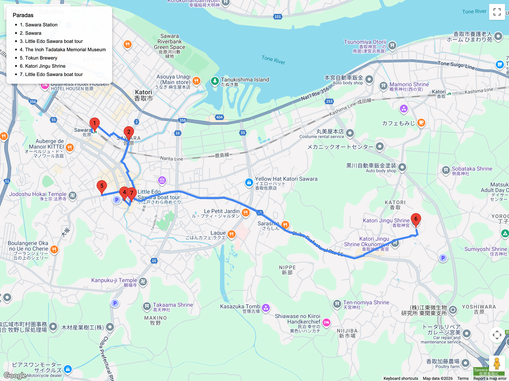

# Bloques en evaluación / opcionales futuros  
## Itinerario: Sawara

---

### Concepto del lugar

Pequeña ciudad Edo a orillas del río Ono, excelente para fotos de almacenes y paseos fluviales. Traslado ~2 h desde Tokio (JR a Narita + tren local).

---

### Estructura general del recorrido

**Tokyo Station → JR Narita → Sawara Station → paseo fluvial → casas históricas → Katori Shrine → retorno**

---

### Distrito histórico

- Camina desde la estación 10 min hasta la zona preservada.  
- Paseo en bote (30 min) por el río; reserva en el muelle principal.  
- Visita la casa de **Inoh Tadataka** (cartógrafo) para entender la importancia geográfica.  
- Fotografía almacenes kura y las lámparas reflejadas en el agua.

### Katori Shrine

- Toma bus o taxi corto hasta el gran santuario **Katori Jingū**, uno de los más antiguos de la región.  
- Bosques sagrados, goshuin especial y ambiente muy tranquilo.  
- Combina con degustación de sake local en **Tokun Shuzō**.

### Consejos prácticos

- Muchos comercios cierran martes; verifica antes de ir.  
- Ideal para un día entre semana sin multitudes.  
- Llega antes del mediodía para alcanzar tanto el paseo en bote como el santuario.  
- Puede combinarse con Narita-San si querés extender el día.

### Primavera (marzo-abril)

- El canal de Sawara luce sakura colgante; reserva el paseo en bote temprano para fotos sin demasiados turistas.  
- **Katori Jingū** ofrece goshuin especiales por el equinoccio; pregunta en la oficina principal.  
- Las tiendas de dulces venden ediciones de hanami, perfecto para llevar al hotel o comer junto al río.
