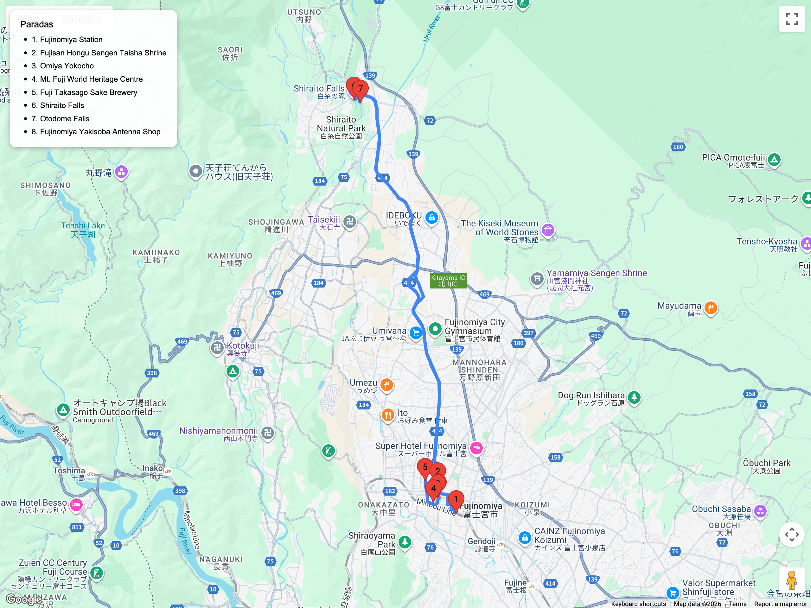

# Bloques en evaluación / opcionales futuros  
## Itinerario: Fujinomiya

---

### Concepto del lugar

Base del Monte Fuji por el lado sur. Combina el santuario Sengen Taisha, cascadas de Shiraito y comida local como yakisoba de Fujinomiya. Traslado ~2 h (Shinkansen hasta Mishima + bus).

---

### Estructura general del recorrido

**Tokyo Station → Shinkansen a Mishima/Shin-Fuji → bus a Fujinomiya Station → Sengen Taisha → Fujisan World Heritage Center → Shiraito Falls → regreso**

---

### Santuario Fujisan Hongū Sengen Taisha

- Centro espiritual para venerar a Fuji; jardines con estanque de manantial.  
- Goshuin especiales y exposición sobre ascenso.  
- Pasea por la calle Omiya Yokocho para probar yakisoba local y dulces.

### Patrimonio Fuji

- Visita el **Mt. Fuji World Heritage Center** (arquitectura espectacular, vista del volcán si está despejado).  
- Opcional: museos de sake como **Wakatsuru** o la cervecería local.  
- Compras de artesanías hechas con aguas de Fuji.

### Cascadas de Shiraito & Otodome

- Bus turístico desde la estación (aprox. 30 min).  
- Senderos cortos con plataformas de observación; arcoíris frecuentes en días soleados.  
- Lleva impermeable ligero por el rocío.  
- Café local con helado de leche fresca.

### Consejos prácticos

- Recomendable revisar clima: si Fuji está cubierto quizá quieras reprogramar.  
- Hay lockers en Fujinomiya Station pero pocos; viaja liviano.  
- El bus a las cascadas opera con horario reducido fuera de temporada; toma la primera salida posible.  
- Ideal para quienes ya hicieron Hakone y buscan otra vista de Fuji sin subir la montaña.

### Primavera (marzo-abril)

- Es común ver el Fuji aún nevado: intentá llegar temprano para vistas despejadas antes de que se formen nubes.  
- El santuario Sengen Taisha monta festivales de primavera y puestos de comida; verificá el calendario.  
- Las cascadas **Shiraito** tienen caudal alto por el deshielo, lo que aumenta el rocío: llevá rompevientos ligero.
