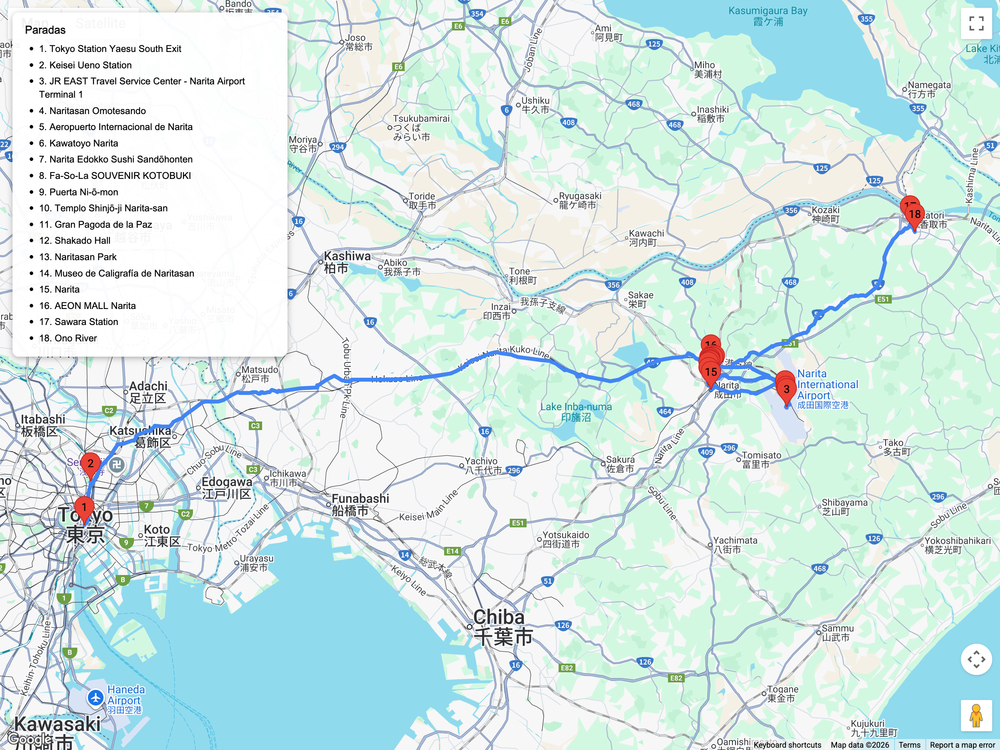

# Bloques de excursión (fuera de Tokio)  
## Itinerario: Narita + Naritasan Shinshō-ji + Omotesandō

---

### Concepto del lugar

Excursión corta a la ciudad vieja de Narita: calle Omotesandō con ryōtei de anguila, complejo monástico Naritasan Shinshō-ji con pagoda y parque lleno de estanques. De yapa, desvío rápido a Sawara para sumar canales Edo si queda energía.

---

### Estructura general del recorrido

**Tokyo Station / Ueno → JR Sobu Rapid o Keisei → Narita Station → Omotesandō → Naritasan Shinshō-ji → Naritasan Park + Museo de Caligrafía → mercado de anguilas → Sawara opcional → regreso**

---

### Pasajes y transporte local

- Con **JR Pass** o suelto tomá el **JR Sobu Rapid** hasta Narita Station (70 min); si te queda más cómodo Ueno, usá **Keisei Main Line Limited Express** (60 min, IC card ok).  
- Desde el aeropuerto también sale la línea Keisei; confirmá si conviene dejar equipaje ahí y seguir directo al templo.  
- Sawara queda a 25 min en el **JR Narita Line (local)**; coordiná horarios porque la frecuencia baja a 1 tren/hora fuera de pico.

---

### Omotesandō y preparativos

- Desde la estación seguí la señalización “Naritasan” y caminá la calle **Omotesandō** (800 m) con fachadas bajas Meiji-Taishō.  
- Paradas claves: **Takashimaya Honten** (dulces), **Kawatoyo** y **Unagi Edokko** para anguila a la parrilla, **Tōkaiten** para snacks de cacahuate.  
- Mirá talleres de tambores taiko y tiendas de incienso para souvenirs religiosos discretos.

### Naritasan Shinshō-ji y parque

- Entrá por la **Puerta Niōmon** y recorré el salón principal con ofrendas de goma fuego.  
- Subí a la **Gran Pagoda de la Paz** y al templo Shakado para ver relieves tallados.  
- Bajá al **Naritasan Park**: lago Benten con koi, cascadas y senderos de musgo; en marzo florecen los ume, después sakura y azaleas.  
- Museo de caligrafía (calligraphy museum) exhibe pergaminos del periodo Edo y tiene folletos en inglés.

### Sawara o desvíos cortos

- Si queda tiempo, tomá JR local hasta **Sawara** para caminar la ribera del río Ono y los almacenes históricos (ver bloque 23 cuando se mueva de evaluación).  
- Alternativa express: barrio **Gion** detrás del parque para ver casas de músicos y comprar wagashi temáticos del festival Gion.  
- Para quienes necesiten logística aeropuerto, aprovechá el **AEON Mall Narita** (bus cada 30 min) para última compra antes de volver a Tokio o seguir a vuelos.

### Consejos prácticos

- Llegá antes de las 10:00 para ver los monjes en ceremonia goma; si querés asistir, registrate en la oficina del templo (donación sugerida).  
- Guardá efectivo para anguila (¥3.000–4.000) y souvenirs; pocas casas aceptan tarjeta extranjera.  
- Evitá fines de semana de febrero/marzo durante el **Narita Plum Blossom Festival** si no te gustan las multitudes; en esos días se vuelve ideal llegar por Keisei y caminar desde la estación de ese lado.  
- Clima cambiante: llevá abrigo ligero porque el parque es ventoso; en verano hay mosquitos cerca de los estanques.

### Primavera (marzo-abril)

- Ume en el parque desde fines de febrero, sakura en cascada alrededor del lago Benten a principios de abril.  
- Omotesandō arma **koinobori** y faroles de primavera; dan buen marco para fotos si llegás temprano.  
- Los restaurantes de anguila preparan ediciones con sanshō fresco y pickles de bambú, ideales para quien quiera un almuerzo estacional antes de volver a Tokio.
