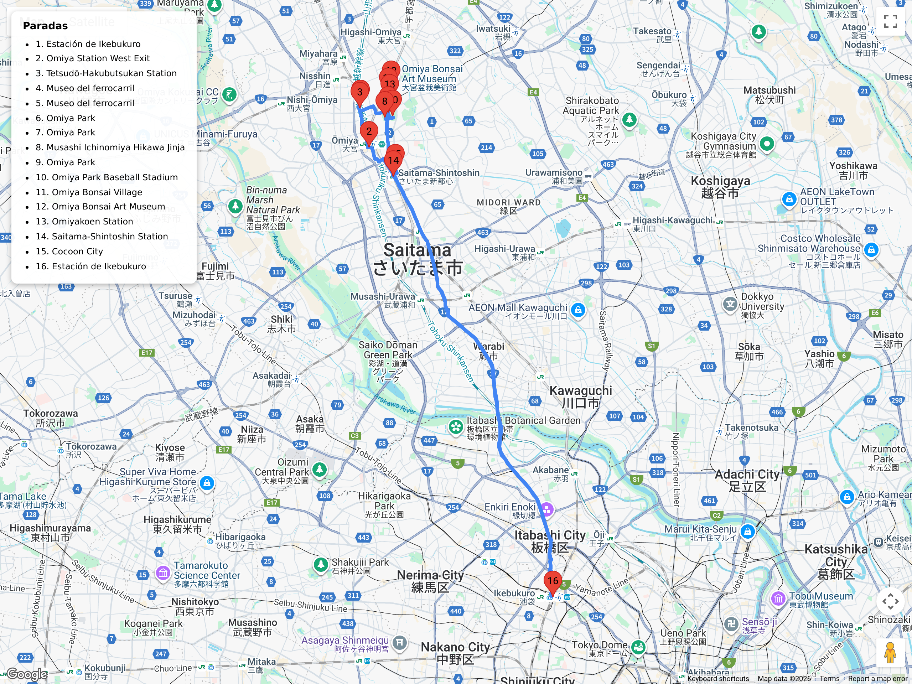

# Bloques de excursión (fuera de Tokio)  
## Itinerario: Saitama (Railway Museum + Omiya Bonsai)

---

### Concepto del lugar

Excursión corta al norte de Tokio para fanas del transporte: combina el **Museo del Ferrocarril** (Railway Museum) con paseo verde por Omiya Park, Hikawa-jinja y el histórico **Omiya Bonsai Village**. Todo queda conectado por JR y el New Shuttle, ideal para mover las piernas pero volver a Tokio sin logística complicada.

---

### Estructura general del recorrido

**Ikebukuro/Shinjuku → Omiya Station → New Shuttle hasta el Railway Museum → Museo + mirador → regreso a Omiya → Omiya Park + Hikawa Shrine → Omiya Bonsai Village + Bonsai Art Museum → Saitama Shintoshin / Cocoon City (cena) → regreso a Tokio**

---

### Pasajes y transporte local

- Desde **Ikebukuro/Shinjuku** tomá la **JR Saikyō o Shōnan-Shinjuku Line** directo a **Omiya** (25-35 min, IC card o JR Pass).  
- Desde **Tokyo/Ueno**, usá la **JR Utsunomiya/Takasaki Line** (25 min).  
- En Omiya seguí la señalización al **Saitama New Urban Transit (New Shuttle)**; comprá pasaje suelto (¥210) o usá IC. Bajate en **Tetsudō-Hakubutsukan** (1 parada).  
- Volvé a Omiya caminando 20 min a través del viaducto si querés vistas ferroviarias, o retomá el New Shuttle.  
- Para el Bonsai Village, tomá la **Tōbu Urban Park Line** hasta **Ōmiya-Kōen** (5 min) o caminá 15 min desde Omiya Park, lo que permite unir todas las paradas sin depender tanto del tren.

---

### Museo del Ferrocarril

- Abrí el día acá: menos gente al inicio y hay luz suave para fotos en los hangares.  
- Comprá entrada en máquinas (¥1.500) y guardá mochilas en lockers al lado izquierdo.  
- Recorrido sugerido: piso 2 para timeline ferroviario, bajá al piso 1 para la **turntable** con locomotoras históricas y simulaciones.  
- Probá los **simuladores de E5 Shinkansen** (sacar turno apenas entres; se agotan).  
- Subí a la terraza para ver el tráfico de la Shinkansen viaduct; llevá teleobjetivo si querés spotting.  
- El restaurante “Nippori 1896” tiene menú infantil inspirado en cajas de bento ferroviarias; buena pausa antes de seguir.

### Omiya Park + Hikawa-jinja

- Volvé a Omiya y entrá al parque por la avenida de torii gigantes de **Omiya Hikawa Shrine** (uno de los más antiguos del Kantō).  
- Paseá la avenida principal con puestos de taiyaki y souvenirs clásicos de festival; buscá los goshuin especiales de sakura.  
- Dentro del parque hay estanques, pedaleo en botes y un pequeño zoológico gratuito (útil si llueve porque varias áreas están techadas).  
- Caminá hacia el **Ōmiya Park Baseball Stadium** y tomá la ruta lateral que conecta con el Bonsai Village, evitando calles vehiculares.

### Omiya Bonsai Village y museo

- Fundado tras el Gran Terremoto de 1923, mantiene talleres familiares abiertos al público; respetá la etiqueta (no tocar ni fotografiar donde digan “No photo”).  
- Visitá estudios como **Mansei-en**, **Fuyo-en** y **Seiko-en**, cada uno especializado en estilos distintos.  
- El **Omiya Bonsai Art Museum** (¥310) explica estilos y herramientas; pedí la audioguía gratuita en español/inglés.  
- Comprá herramientas o macetas pequeñas en las tiendas del museo; ideal para quien quiera ampliar su kit de jardinería sin gastar de más.  
- Al terminar podés volver caminando a Omiya (25 min) o tomar la Tōbu Urban Park Line desde Ōmiya-Kōen.

### Saitama Shintoshin / Cocoon City

- Antes de regresar a Tokio, pasá por **Saitama Shintoshin** (a 1 parada JR de Omiya) para cenar sin apuro.  
- **Cocoon City** tiene izakaya y cafeterías nuevas, además de tiendas para comprar ropa deportiva japonesa.  
- Si necesitás un bar tranquilo, subí al piso 4 de Cocoon 2 para terrazas con vista a las vías iluminadas.

### Consejos prácticos

- El museo cierra a las 17:00 (último ingreso 16:30); llegá antes de las 10:00 para cubrir todas las salas.  
- Guardá efectivo para entradas (Railway Museum y Bonsai Art Museum aceptan tarjeta, pero los viveros no).  
- Revisá la web del museo para saber si hay simuladores cerrados por mantenimiento.  
- El Bonsai Village es residencial: mantené volumen bajo y evitá consumir alimentos dentro de los talleres.  
- Para spotting nocturno, buscá el mirador público de la estación Saitama Shintoshin; cierra a las 21:00.

### Primavera (marzo-abril)

- **Omiya Park** tiene más de mil cerezos; el camino hacia Hikawa-jinja es un túnel rosa si vas entre el 28 de marzo y el 5 de abril aprox.  
- El Railway Museum arma exhibiciones temporales de trenes florales (micro jardines sobre plataformas), buenas para fotos macro.  
- En el Bonsai Village aparecen lotes especiales de **shohin** (bonsái miniatura) preparados para hanami; llegan visitantes de todo Japón, así que andá temprano si querés charlar con artesanos sin multitudes.
