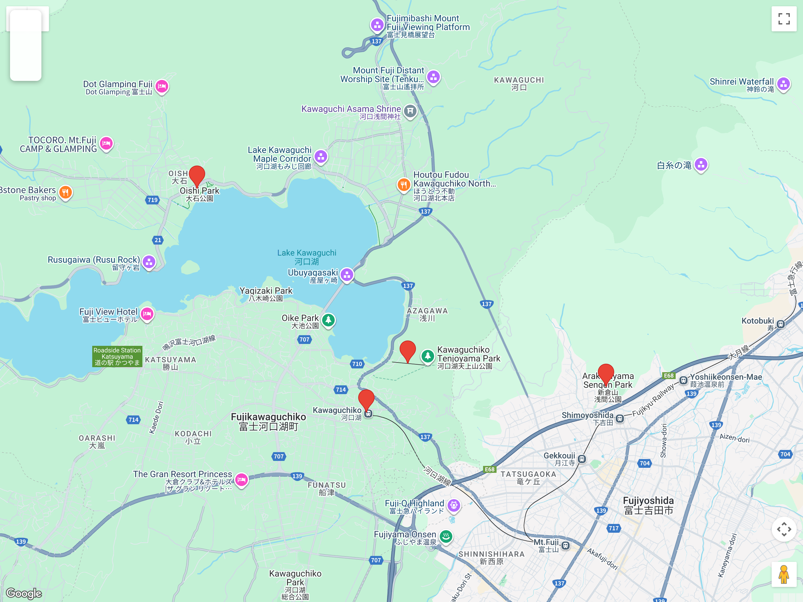

# Bloques de excursión (fuera de Tokio)  
## Itinerario: Kawaguchiko + miradores del Fuji

---

### Concepto del lugar

Kawaguchiko es la base más directa para ver el Monte Fuji desde el norte. Combina lago, miradores y pueblo local; la clave es ir temprano y ajustar el recorrido según el clima.

---

### Estructura general del recorrido

**Itabashi/Ikebukuro/Shinjuku → Kawaguchiko Station → (opción A) Shimoyoshida/Chureito → costa norte (Oishi Park) → Kachi Kachi Ropeway → paseo por el lago → regreso**

---

### Transporte y llegada

#### Desde Itabashi: opciones recomendadas

| Opción | Ruta | Tiempo | Precio (aprox) | Notas |
|--------|------|--------|----------------|-------|
| **A - Bus directo (recomendado)** | Itabashi → Ikebukuro (JR Saikyo, 5 min) → bus Highway Express a Kawaguchiko | ~1h 50min | ¥2,200-2,500 | Más cómodo, asiento reservado, primera salida ~6:30am desde Ikebukuro |
| **B - Tren directo** | Itabashi → Shinjuku (JR Saikyo/Toei Mita, 12 min) → Limited Express Kaiji a Kawaguchiko | ~2h 10min | ¥4,100 (con JR Pass cubierto hasta Otsuki, luego ¥1,210) | Sin transbordos de bus, panorámico |
| **C - Económica** | Itabashi → Shinjuku → JR Chuo Line rápido a Otsuki → Fujikyuko Line a Kawaguchiko | ~2h 45min | ¥2,520 | Más barata pero requiere transbordo en Otsuki |

#### Horarios de salida desde Itabashi (ejemplo)

- **Para llegar a Kawaguchiko ~8:30am:** salir de Itabashi ~6:15am (opción A) o ~6:00am (opción C)
- **Para llegar ~10:00am:** salir ~7:30am (cualquier opción)
- **Último retorno recomendado:** bus 18:30-19:00 desde Kawaguchiko, llega Ikebukuro/Shinjuku ~20:30-21:00

#### Reservas

- **Buses Highway Express:** comprá online en advance o en la misma mañana si hay lugar; fines de semana reservá con 1-2 días de anticipación  
- **Limited Express Kaiji:** JR Pass cubre todo el trayecto; sin JR Pass, comprá ticket en máquinas verdes de Shinjuku  
- **Fujikyuko Line:** no necesita reserva, pago con IC o boleto en Otsuki

#### Desde la estación Kawaguchiko

- Buses locales circulares (Red Line/Green Line) recorren los puntos turísticos del lago; pase de 2 días (~¥1,500) o boleto simple (~¥150-300 por tramo)  
- Alquiler de bicicletas eléctricas (~¥1,500-2,000/día) para recorrer la costa norte a tu ritmo  
- Si preferís caminar, la zona céntrica (Kachi Kachi Ropeway, Oishi Park) está en radio de 20-30 min a pie

### Chureito y Fujiyoshida (opcional)

- Subida al **Parque Arakurayama Sengen** para la vista clásica con pagoda; es escalera, no es plano.  
- Si el cielo está despejado, hacelo temprano; si hay nubes bajas, saltalo y guardalo para otra fecha.  
- En el pueblo, los santuarios chicos y las calles residenciales muestran un Japón más rural.

### Costa norte del lago (Oishi Park)

- La costa norte suele tener mejores vistas abiertas del Fuji.  
- **Oishi Park** tiene flores por estación y senderos cortos junto al lago.  
- Si el Fuji está tapado, caminá el lago igual: el paisaje sigue siendo agradable y tranquilo.

### Kachi Kachi Ropeway y miradores

- El ropeway sube a un mirador con vista frontal del lago y el Fuji.  
- Si hay viento fuerte puede cerrar: dejalo como bloque flexible en el recorrido.  
- Buen punto para fotos de tarde si el cielo se limpia hacia el final del día.

### Extras si queda tiempo

- **Museo de Música** o **Kubota Itchiku** (arte textil), ideales si el clima se complica.  
- Paseo en barco por el lago; no siempre aporta vista del Fuji, pero da una perspectiva distinta.

### Consejos prácticos

- Mirá el pronóstico y salí temprano: las mejores vistas suelen ser antes del mediodía.  
- Llevá abrigo: el lago es ventoso incluso en días despejados.  
- Evitá valijas grandes; usá lockers en Kawaguchiko Station.  
- Si el Fuji no aparece, convertí el día en paseo de lago + museo y dejá los miradores para otra fecha.

### Primavera (marzo-abril)

- En abril florecen sakuras en **Chureito** y el borde del lago; si hay festival, llegá temprano.  
- En marzo aún puede haber frío intenso; llevá capas y guantes livianos.  
- El Fuji con nieve es más común en mañanas frías y despejadas.
