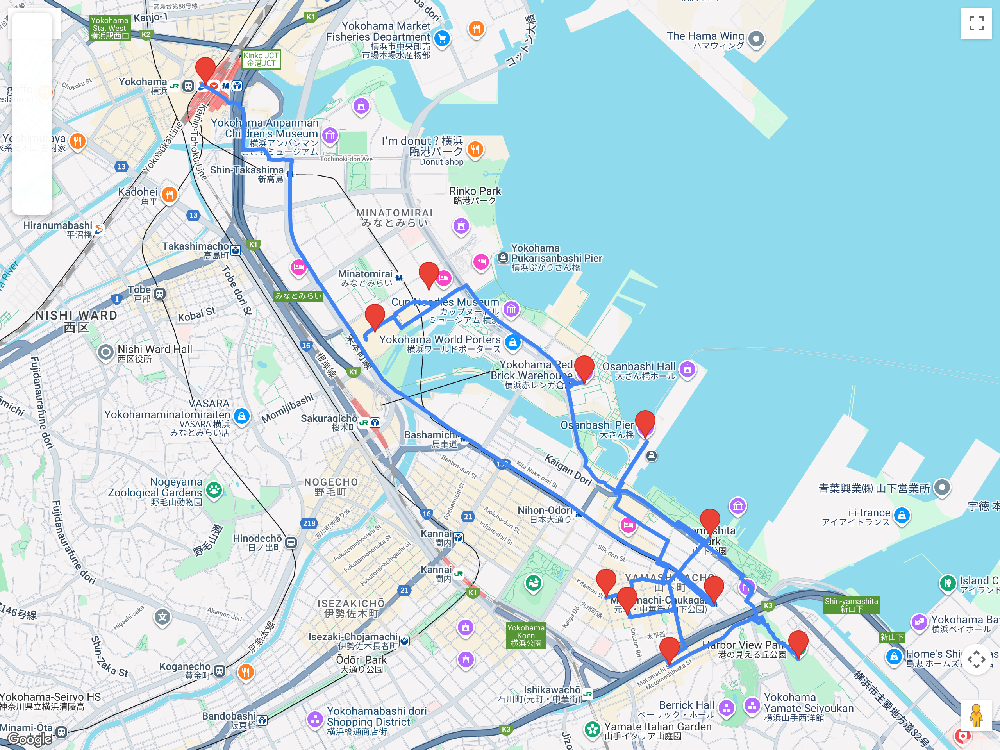

# Bloques de excursión (fuera de Tokio)  
## Itinerario: Yokohama (Chinatown + Yamashita + Minato Mirai)

---

### Concepto del lugar

Yokohama mezcla puerto histórico, barrio chino enorme y un frente moderno con rascacielos y paseos costeros. Es ideal para un día completo fuera de Tokio sin perder ritmo urbano.

---

### Estructura general del recorrido

**Tokyo/Shinagawa → Motomachi-Chukagai → Chinatown → Yamashita Park → Motomachi → Harbor View Park → Minato Mirai (Red Brick + Landmark) → regreso**

---

### Pasajes y transporte local

- Ruta simple: **JR hasta Yokohama** y luego **Minatomirai Line** hasta **Motomachi-Chukagai**.  
- Alternativa directa: **Tokyu Toyoko Line** (que se convierte en Minatomirai) desde Shibuya, sin cambios.  
- Arrancá temprano para aprovechar Chinatown con menos filas.

### Chinatown (Chukagai)

- Entrá por el **Zenrinmon** y caminá las calles laterales, no solo la avenida principal.  
- Probá un set chico de dim sum y guardá lugar para postre (manju o taiyaki chino).  
- Si les interesa, pasen por el **Kanteibyo** (templo dedicado a Guan Yu), rápido y muy fotogénico.

### Yamashita Park + waterfront

- Caminata corta desde Chinatown al **Yamashita Park** para abrir el día con vista al puerto.  
- Parada breve en el **Ōsanbashi Pier** (si hay energía): excelente mirador sin mucha gente.

### Motomachi + Harbor View Park

- **Motomachi** es una calle elegante con boutiques y cafés; buena para pausa tranquila.  
- Subí al **Harbor View Park** para tener un panorama claro de la bahía y del barrio.

### Minato Mirai (tarde)

- Cerrá el día en **Red Brick Warehouse** y la zona de **Landmark Tower/Queen’s Square**.  
- Es ideal para atardecer + cena; los edificios se iluminan temprano en primavera.

---

### Consejos prácticos

- Dejá Chinatown para el almuerzo y evitá las 12:30 si querés menos filas.  
- No intentes “todo”: elegí parque + barrio chino + Minato Mirai como núcleo.  
- Si llueve, reducí parque y priorizá interiores (Red Brick, Landmark, centros comerciales).
- Día completo recomendado (salida 9:00, regreso 19:00).  
- Si necesitás versión corta: **Chinatown + Yamashita Park + Motomachi** y vuelta.

### Primavera (marzo-abril)

- **Yamashita Park** y el frente costero tienen sakura temprana; buen lugar para fotos abiertas.  
- En Minato Mirai suele haber eventos de temporada en Red Brick; mirá cartelería al llegar.  
- El atardecer es clave: la luz baja hace que la bahía se vea más limpia en fotos.
