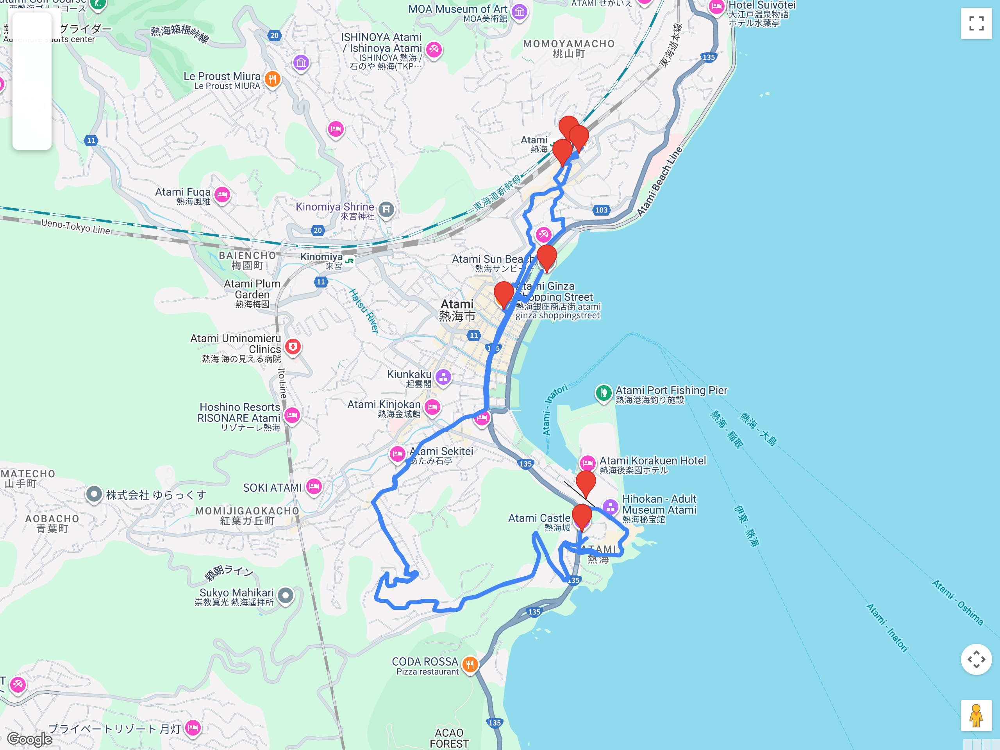

# Bloques de excursión (fuera de Tokio)  
## Itinerario: Atami (cafés Shōwa + onsen + costa) — con extensión opcional a Mishima

---

### Concepto del lugar

Atami es una ciudad costera clásica de escapada desde Tokio, con aire retro de posguerra.  
Funciona como combinación de **kissaten de era Shōwa**, paseo marítimo y onsen sin dormir afuera.  
Con energía extra, se puede extender el recorrido hasta **Mishima** para sumar un santuario histórico.

---

### Estructura general del recorrido

**Opción A (clásica):**  
Tokyo/Shinagawa → Atami Station → Heiwadori Shotengai → cafés Shōwa → Atami Sun Beach → Atami Castle o Ropeway → onsen/ashiyu → regreso

**Opción B (con extensión):**  
...Atami → (tren 15–20 min) → **Mishima Station** → **Mishima Taisha** → regreso por Mishima

---

### Cómo llegar a Atami desde Tokio

Tenés tres opciones principales, ordenadas por velocidad/precio:

#### 1. Shinkansen Kodama (rápido, más caro)
- **Desde:** Tokyo Station o Shinagawa Station  
- **Duración:** ~35–45 min hasta Atami  
- **Precio:** ~¥3,500–4,000 (no incluye JR Pass básico, necesitás pase Premium o pagar suplemento)  
- **Pros:** rápido, sin reserva previa (podés subir con JR Pass Premium o comprar ticket en máquina)  
- **Contras:** más caro, paisaje menos interesante que el tren de costa

#### 2. Limited Express Odoriko (balance velocidad/precio, **requiere reserva**)
- **Desde:** Tokyo Station, Shinjuku Station o Shinagawa Station  
- **Duración:** ~1h 20min hasta Atami  
- **Precio:** ~¥2,500–3,000 + tarifa de asiento reservado (~¥1,000)  
- **Pros:** recorre la costa del Pacífico (vistas al mar), más rápido que el local, cómodo  
- **Contras:** **requiere reserva de asiento obligatoria**

**Cómo reservar el Odoriko:**
- **Máquinas JR (Midori no Madoguchi):** tocá "Reserved Seat Ticket", elegí "Limited Express", fecha y horario. Las máquinas tienen idioma inglés. Pagás con efectivo o tarjeta IC (Suica/Pasmo).  
- **Ventanilla:** acercate a "Midori no Madoguchi" en cualquier estación JR grande, decí "Atami made Odoriko yoyaku onegaishimasu". Te piden fecha, horario aproximado y número de pasajeros.  
- **JR East App (previo a viaje):** si tenés JR Pass regional o querés comprar online, la app "JR EAST Train Reservation" permite reservar con tarjeta de crédito. Después retirás el ticket en máquina con QR.  
- **Consejo:** reservá con 1–2 días de anticipación en fines de semana; entre semana suele haber lugares el mismo día.

#### 3. JR Tōkaidō Line (local, más barato, sin reserva)
- **Desde:** Tokyo Station, Shinagawa, Kawasaki, Yokohama  
- **Duración:** ~1h 40min–2h hasta Atami (depende del servicio, algunos requieren transbordo en Odawara o Kozu)  
- **Precio:** ~¥1,500 (cubierto por JR Pass estándar, no necesita reserva)  
- **Pros:** más económico, flexible (subís cuando querés), cubierto por JR Pass básico  
- **Contras:** más lento, puede estar parado en hora pico, sin garantía de asiento

**Recomendación práctica:**
- Si tenés JR Pass estándar → Tōkaidō Line local o Shinkansen Kodama (si tenés suplemento)  
- Si querés equilibrar tiempo y plata → Odoriko reservando con anticipación  
- Si salís tarde o volvés tarde → chequeá últimos horarios, el Odoriko deja de circular ~21:00 hs

---

### Transporte local en Atami y Mishima

- Atami es compacta: el centro se recorre caminando; para subir al castillo o al ropeway conviene bus local o taxi corto.  
- **Mishima**: tren local por línea Itō o Tōkaidō (15–20 min desde Atami). El santuario queda a 10–15 min caminando desde la estación.  
- Si volvés tarde, chequeá horarios del último tren con tiempo (varían según el servicio).

---

### Centro retro y shotengai

- **Heiwadori Shotengai** es el corazón retro: tiendas locales, souvenirs y bares antiguos.  
- Avanzá por el corredor comercial y abrí un desvío hacia **Atami Ginza** para ver fachadas de otra época.  
- Ideal para comprar dulces locales y probar snacks salados (típicos de balneario japonés).

---

### Cafés Shōwa (kissaten)

- Buscá 1–2 kissaten de estilo Shōwa para pausa larga (madera oscura, iluminación baja, menú clásico).  
- Pedí **coffee + set** (tostado, huevo, ensalada) o un **pudding** retro.  
- Evitá apilar muchos cafés: mejor uno emblemático y otro breve para fotos/ambiente.

---

### Costa, miradores y postales

- **Atami Sun Beach** tiene vista abierta a la bahía y funciona bien para caminar sin apuro.  
- **Atami Castle** (mirador) o el **ropeway** ofrecen panorámica costera; elegí uno según energía.  
- Si el día está claro, la luz de la tarde es ideal para fotos del litoral.

---

### Onsen y pausas de descanso

- Para una parada corta, usá un **ashiyu** (baño de pies) cerca del centro.  
- Si querés onsen completo, chequeá **day-use** de ryokan u hoteles (suele requerir reserva o horarios acotados).  
- Toalla chica y medias de repuesto ayudan para volver cómodo al tren.

---

### Extensión opcional: Mishima Taisha

Si te queda energía y querés sumar un santuario distinto al circuito de Atami:

- Tomá tren local desde Atami hasta **Mishima Station** (15–20 min).  
- Caminá 10–15 min hasta **Mishima Taisha**: santuario importante de la región, con estanque de carpas koi, torii de piedra y bosque de cedros.  
- El lugar tiene atmósfera tranquila y menos turistas que los santuarios de Tokio; ideal para una pausa reflexiva.  
- Duración estimada: 45–60 min total (ida + santuario + vuelta a estación).  
- Desde Mishima podés volver directo a Tokyo por Shinkansen (más rápido) o continuar hacia Hakone/Fuji si ese es tu plan.

**Veredicto:** sumalo si querés un día largo completo; si preferís relax, quedate en Atami.

---

### Consejos prácticos

- Llevá calzado cómodo: hay subidas suaves hacia miradores y hoteles en ladera.  
- Si vas en fin de semana, llegá temprano para evitar filas en restaurantes y cafés.  
- Sumá un **snack salado** y un dulce retro para equilibrar tantos cafés.  
- Para la extensión a Mishima: verificá horarios de trenes locales (frecuencia cada 20–30 min en general).

---

### Primavera (marzo-abril)

- Hay tramos de **sakura** en la zona central y cerca de la bahía; caminá a ritmo lento para verlos sin apuro.  
- Mishima Taisha también tiene sakura destacados en primavera (iluminación nocturna algunos fines de semana).  
- Si te interesa el sakura nocturno, consultá si hay **iluminaciones** en el paseo central o en Mishima.  
- La brisa del mar puede ser fresca: capa extra liviana recomendada.
