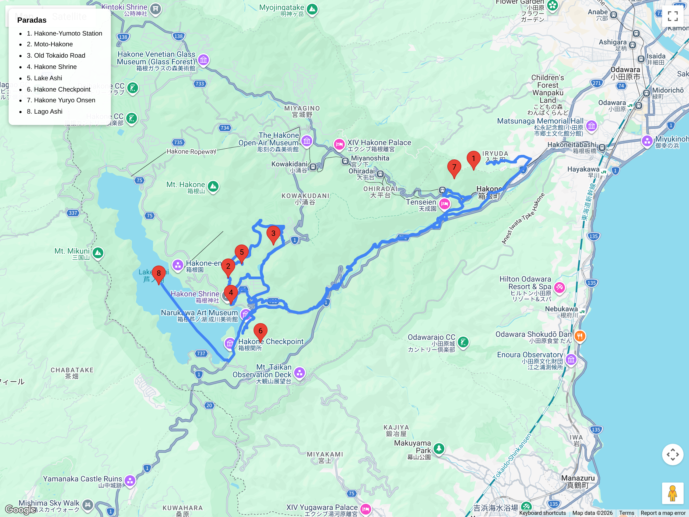

# Bloques de hiking  
## Itinerario: Old Tokaido (Hakone)

---

### Concepto del lugar

Tramo preservado de la antigua ruta Tokaido (ruta del litoral Edo-Kyoto) entre Moto-Hakone y Hakone-Yumoto. Sendero con adoquinado original del siglo XVII, alineación de cedros centenarios y atmósfera de posta histórica. La alternativa costera a la Nakasendo, accesible en día de viaje desde Tokyo.

---

### Estructura general del recorrido

**Shinjuku → Hakone-Yumoto → bus a Moto-Hakone → caminata por Old Tokaido → Hakone Shrine → lago Ashi → regreso a Hakone-Yumoto → onsen opcional**

---

### Transporte y acceso

- **Desde Shinjuku:** Odakyu Romancecar hasta Hakone-Yumoto (85 min, reservar asiento con anticipación).
- **A punto de inicio:** Desde Hakone-Yumoto, tomar bus H o K (línea Hakone Tozan) hasta Moto-Hakone (15 min).
- **Pase recomendado:** Hakone Freepass (2 días) cubre el Romancecar, buses y descuentos en onsen.

### El sendero histórico

- **Distancia:** 9 km  
- **Duración:** 2.5–3 horas  
- **Dificultad:** Fácil (casi plano, bien marcado)  
- **Punto de inicio:** Moto-Hakone (cerca del embarcadero del lago)  
- **Punto final:** Hakone-Yumoto (o inverso)

**Lo que verás:**
- **Ishidatami:** Tramos originales de adoquinado de piedra del período Edo, conservados desde el siglo XVII.
- **Sugi-namiki:** Alineación de cedros japoneses (Cryptomeria) de 400 años plantados por el clan Tokugawa para proteger a los viajeros del sol.
- **Hakone Checkpoint:** Reconstrucción del puesto de control Tokugawa (entrada paga, opcional) con vistas al lago.
- **Hakone Shrine:** Torii flotante en el lago Ashi, acceso por sendero de musgo entre cedros.

### Variantes del recorrido

**Opción corta (1.5 hs):**
- Moto-Hakone → Hakone Shrine → bus de vuelta (4 km).

**Opción extendida (+1 h):**
- Continuar más allá de Hakone-Yumoto hacia **Kowakidani** por el sendero del valle (menos transitado).

**Combinación con crucero:**
- Cruzar el lago Ashi en barco pirata (Moto-Hakone ↔ Hakone-machi) antes o después de caminar.

### Onsen post-caminata

- **Hakone Yuryo:** Onsen con lockers y toallas, a 5 min caminando de Hakone-Yumoto. Descuento con Freepass.
- **Tenzan Tohji-kyo:** Onsen más tradicional en la montaña, requiere bus desde Hakone-Yumoto.
- **Ashiyu (pies):** Fuente de agua termal gratuita junto a la estación de Hakone-Yumoto para descansar sin desvestirse.

### Consejos prácticos

- **Calzado:** Zapatillas de trekking ligeras suficientes; el adoquinado puede resbalarse si llueve.
- **Clima:** La niebla es común; llevar capa impermeable ligera. En invierno puede haber hielo en zonas sombreadas.
- **Agua:** Trae botella; hay pocas fuentes en el sendero (máquinas expendedoras en Moto-Hakone y Hakone-Yumoto).
- **Hora de inicio:** Antes de las 10:00 para evitar grupos organizados que llegan desde las 11:00.
- **Comida:** Bentos disponibles en Hakone-Yumoto antes de subir; o comer en Moto-Hakone después (opciones limitadas).

### Comparativa con Nakasendo

| Aspecto | Old Tokaido (Hakone) | Nakasendo (Magome-Tsumago) |
|---------|---------------------|---------------------------|
| Adoquinado original | ✅ Sí, tramos conservados | ✅ Sí, completo |
| Pueblos de posta | ❌ No (solo checkpoint) | ✅ Sí, pueblos preservados |
| Distancia desde Tokyo | 1.5 hs | 3.5–4 hs |
| Dificultad | Fácil | Fácil-Moderado |
| Montañas | Volcánico (lago, niebla) | Alpino (pasos de montaña) |
| Ideal para | Día corto, accesible | Experiencia completa Edo |

### Primavera (marzo–abril)

- **Sakura:** Los cedros son perennes, pero hay cerezos silvestres en los bordes del lago Ashi (floran mediados de abril).
- **Niebla:** Marzo tiene más días despejados por la mañana; abril aumenta la humedad y niebla sobre el lago.
- **Vistas del Fuji:** Mejor probabilidad en marzo; en abril el calor reduce la nieve en la cumbre pero puede haber más nubes.
- **Eventos:** El Hakone Checkpoint abre exposiciones de primavera con vestimenta samurai para fotos (fines de semana).

---

**Nota:** Este es el primer bloque de la sección hiking. Próximos: Koshu Kaido, Okutama, Takao-san ruta alternativa.
