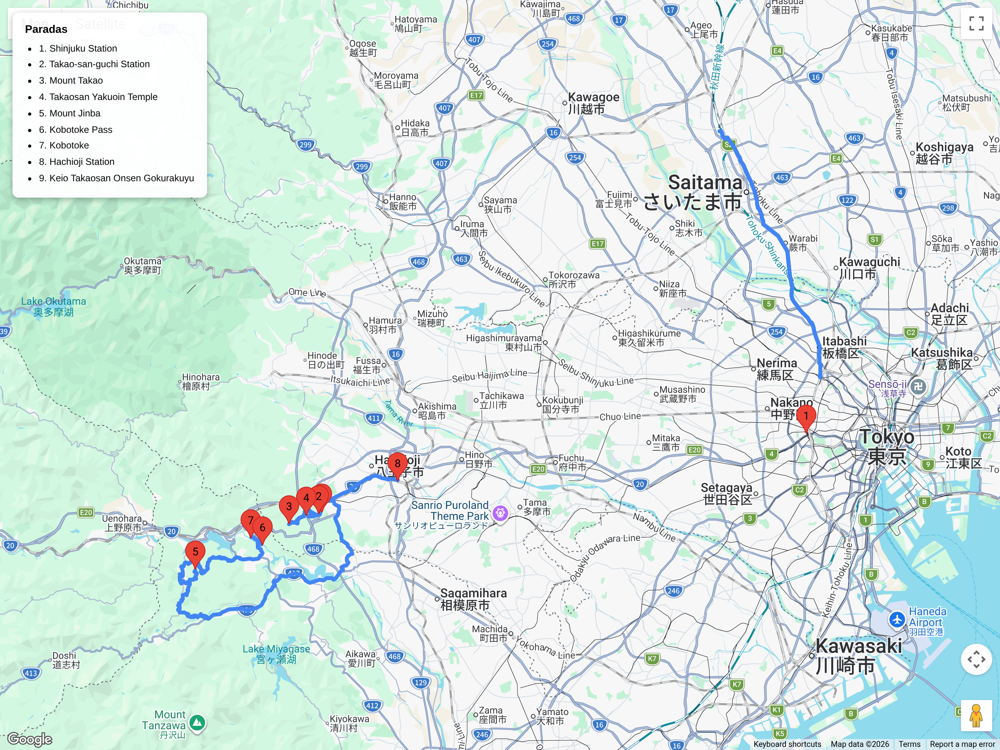

# Bloques de hiking  
## Itinerario: Koshu Kaido (Hachioji)

---

### Concepto del lugar

Tramo de la antigua Koshu Kaido, una de las cinco rutas principales del período Edo que conectaba Edo (Tokyo) con Koshu (actual Yamanashi). Esta sección entre Takao-san y Kobotoke conserva restos del empedrado histórico, el paso de montaña (Kobotoke Pass) y la atmósfera de ruta comercial antigua. Combina historia con senderismo moderado en el oeste de Tokyo.

---

### Estructura general del recorrido

**Shinjuku → Takao-san-guchi → sendero hasta Jinba-san → Kobotoke Pass → Kobotoke → regreso por ruta alternativa o bus**

---

### Transporte y acceso

- **Desde Shinjuku:** Keio Line semi-especial o especial hasta Takao-san-guchi (50 min, sin transbordo).
- **Alternativa:** JR Chuo Line hasta Takao, luego Keio Line 1 parada hasta Takao-san-guchi (más lento).
- **Regreso:** Desde Kobotoke, bus hasta la estación Hachioji (20 min) o caminata de vuelta circular.

### El sendero histórico

- **Distancia:** 15 km (circular)  
- **Duración:** 5–6 horas  
- **Dificultad:** Moderado (subida al Jinba-san 857m, terreno irregular en tramos)  
- **Punto de inicio:** Takao-san-guchi (salida del templo Takao)  
- **Punto alto:** Jinba-san (857m), con vistas al Fuji y a Tokyo

**Lo que verás:**
- **Takao-san:** Si se opta por no subir por el cable car, el sendero 1 (Omotesando) es el camino histórico original de 800 años con raíces expuestas y templo Yakuoin.
- **Kobotoke Pass:** El punto más alto de la antigua ruta comercial, con restos de empedrado original y vistas al valle de Koshu.
- **Jinba-san:** Cumbre con dos esculturas de caballos de piedra (jinba = caballos de dios) y mirador de 360°.
- **Restos de ishidatami:** Tramos cortos del adoquinado Edo entre Takao y Kobotoke, especialmente cerca del paso.

### Variantes del recorrido

**Opción corta (3 hs, 8km):**
- Takao-san-guchi → Takao-san cumbre → bajar por ruta diferente → vuelta a la estación.
- No incluye Kobotoke ni la ruta histórica completa.

**Opción lineal (4 hs, 10km):**
- Takao-san-guchi → Jinba-san → Kobotoke → bus a Hachioji (sin regreso a pie).
- Requiere planificar el bus de regreso (horarios cada 30-60 min).

**Opción extendida (+2 hs):**
- Continuar desde Jinba-san hasta **Mt. Shiroyama** (670m) y bajar a Sagamiko para combinar con el lago.

### Onsen post-caminata

- **Keio Takaosan Onsen Gokurakuyu:** Onsen moderno a 5 min de Takao-san-guchi, ideal si se regresa por la misma ruta.
- **Hachioji Onsen:** Opciones en la ciudad si se termina en Kobotoke y toma el bus a Hachioji.
- **Ashiyu en Takao-san-guchi:** Fuente de pies gratuita junto a la estación.

### Consejos prácticos

- **Calzado:** Zapatillas de trekking obligatorias; el empedrado histórico es irregular y puede estar resbaladizo.
- **Clima:** La niebla es común en el Kobotoke Pass; llevar capa impermeable. En invierno puede haber hielo en la cumbre.
- **Agua:** Trae 1.5L; hay pocas fuentes después de Takao-san. Máquinas expendedoras en Takao-san-guchi y Kobotoke.
- **Hora de inicio:** Antes de las 8:30 para terminar con luz natural (invierno) o evitar nubes de tarde (verano).
- **Comida:** Bentos en Takao-san-guchi; restaurantes de soba en la cumbre de Takao-san (caros, horario limitado).

### Comparativa con Old Tokaido (Hakone)

| Aspecto | Koshu Kaido (Hachioji) | Old Tokaido (Hakone) |
|---------|----------------------|---------------------|
| Adoquinado original | ✅ Tramos en el paso | ✅ Más extenso |
| Dificultad | Moderado | Fácil |
| Vistas | Fuji + Tokyo (si despeja) | Lago + montañas |
| Distancia desde Tokyo | 50 min | 1.5 hs |
| Onsen | Básico/al final | Variado/integrado |
| Ideal para | Ejercicio + historia | Día relajado accesible |

### Primavera (marzo–abril)

- **Sakura:** Cerezos silvestres en los valles cercanos a Takao-san, floración tardía (finales de marzo a principios de abril) por la altitud.
- **Niebla:** Común en el Kobotoke Pass por la mañana; despeja hacia el mediodía.
- **Vistas del Fuji:** Mejor probabilidad en marzo por aire invernal; abril tiene más humedad.
- **Flora:** Shimotsuke (rosa japonesa) y azaleas comienzan en abril en las laderas bajas.
- **Eventos:** Takao-san Hiwatari-sai (fuego) en marzo, aunque es más espectacular en otoño.

---

**Nota:** Segundo bloque de hiking. Próximo: Okutama (Tama River Trail).
