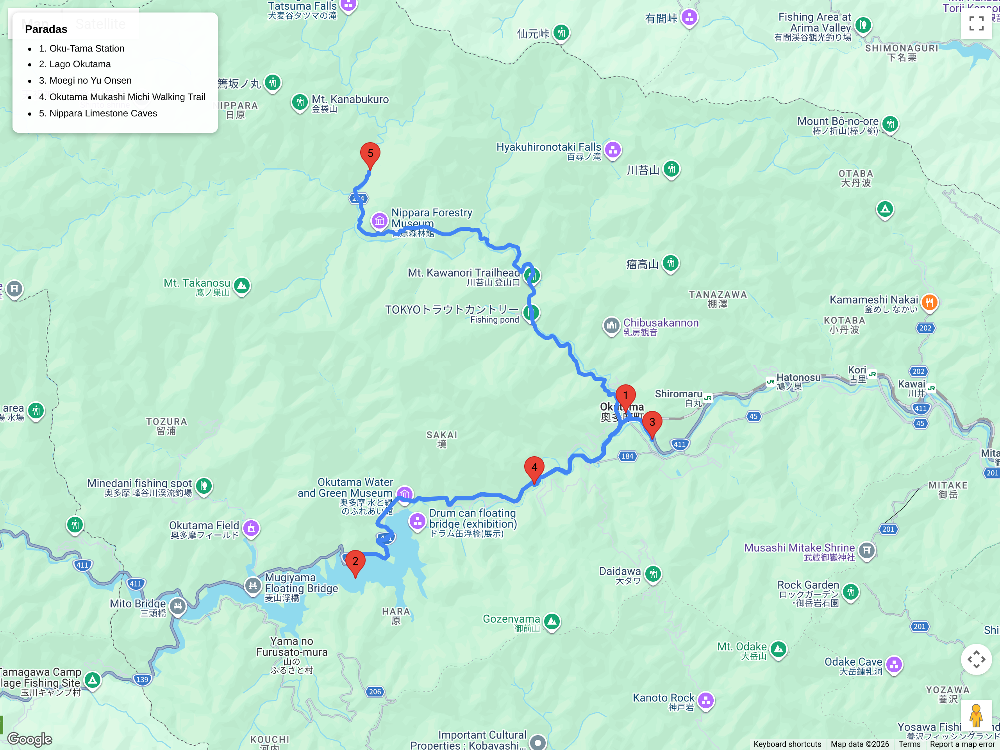

# Bloques de hiking  
## Itinerario: Okutama (Tama River Trail)

---

### Concepto del lugar

Okutama es el extremo oeste de Tokyo, una región montañosa donde el río Tama serpentea entre valles boscosos y gargantas. El Tama River Trail sigue el curso del río desde la estación de Okutama hasta la presa de Lake Okutama, combinando sendas fluviales, puentes colgantes, túneles de vegetación y antiguos asentamientos de madereros. Es senderismo suave con opciones de extensión hacia cumbres circundantes.

---

### Estructura general del recorrido

**Shinjuku → Okutama Station → Tama River Trail → Nippara Valley (opcional) → Lake Okutama → regreso por misma ruta o bus**

---

### Transporte y acceso

- **Desde Shinjuku:** JR Chuo Line hasta Tachikawa, transbordo a JR Ome Line hasta Okutama (1h 40min).
- **Alternativa:** JR Chuo Line hasta Ome, luego continuación en Ome Line hasta Okutama (similar tiempo).
- **Regreso:** Desde Lake Okutama, bus local hasta Okutama Station (15 min, cada 1-2 horas) o caminata de retorno.

### El sendero fluvial

- **Distancia:** 12 km (ida) / 18 km (circular con variantes)
- **Duración:** 4–5 horas
- **Dificultad:** Fácil a moderado (casi sin desnivel, pero terreno irregular en orilla)
- **Punto de inicio:** Puente cerca de Okutama Station (bajando hacia el río)
- **Punto final:** Presa de Lake Okutama

**Lo que verás:**
- **Tama River Trail:** Senda que serpentea junto al río, cruzando puentes pequeños y pasando entre bambúales y bosque de cedros.
- **Nippara Valley (desvío opcional):** Garganta lateral con acantilados de piedra caliza, templo excavado en roca y aguas cristalinas (añade +2 hs).
- **Lake Okutama:** Embalse artificial rodeado de montañas, espejo de agua que abastece Tokyo. La presa ofrece vistas panorámicas.
- **Puentes colgantes:** Dos pequeños puentes de cables que cruzan el río y tributarios, típicos de la zona rural japonesa.
- **Antiguos asentamientos:** Casas de madera abandonadas y restos de infraestructura de madereros del siglo XX.

### Variantes del recorrido

**Opción corta (2.5 hs, 6km):**
- Okutama Station → 3km por el río → punto de retorno antes del lago.
- Ideal para día relajado sin comprometerse al lago completo.

**Opción con Nippara Valley (+2 hs):**
- Desvío hacia la garganta de Nippara, visitar el templo de piedra y retornar al río principal.
- Requiere buena condición física por terreno rocoso.

**Opción extendida (+3 hs):**
- Subida a **Mt. Mito** (1528m) desde Lake Okutama, cumbre con vistas a las tres montañas sagradas de Okutama.

### Onsen post-caminata

- **Moegi no Yu (Okutama):** Onsen local a 10 min de la estación, con baño al aire libre y vistas al río.
- **Nippara Onsen:** Opción más rústica cerca de la garganta, accesible si se hace el desvío.

### Consejos prácticos

- **Calzado:** Zapatillas de trekking ligeras; el sendero puede estar embarrado después de lluvia.
- **Clima:** La zona es más fría que Tokyo central; llevar capa incluso en primavera. Niebla común en mañanas.
- **Agua:** Trae 1L; hay fuentes naturales filtradas en algunos puntos, pero no confiar ciegamente.
- **Hora de inicio:** Antes de las 9:00 para asegurar luz natural de retorno (el bosque oscurece temprano).
- **Comida:** Pocas opciones en el camino; comprar bento en la estación de Okutama antes de salir.
- **Fauna:** Monos, ciervos y aves rapaces comunes; no alimentar ni acercarse.

### Comparativa con Koshu Kaido

| Aspecto | Okutama (Tama River) | Koshu Kaido (Hachioji) |
|---------|---------------------|----------------------|
| Tipo de paisaje | Río + bosque + lago | Historico + montaña |
| Dificultad | Fácil a moderado | Moderado |
| Desnivel | Mínimo | Significativo (857m) |
| Distancia desde Tokyo | 1h 40min | 50 min |
| Onsen | Rústico/natural | Moderno/urbano |
| Ideal para | Naturaleza tranquila | Ejercicio + historia |

### Primavera (marzo–abril)

- **Sakura:** Cerezos silvestres a lo largo del río, floración tardía por la altitud (principios de abril).
- **Nieve residual:** Posible en sombras del valle hasta mediados de marzo.
- **Nivel del río:** Alto por deshielo; algunos tramos del sendero pueden estar inundados temporalmente.
- **Flora:** Floración de ume (ciruelo) en febrero-marzo en los pueblos cercanos; nemofila azul en praderas cercanas al lago (finales de abril).
- **Fauna:** Temporada de anidación de aves; madrugar aumenta probabilidad de avistamientos.

---

**Nota:** Tercer bloque de hiking. Próximo: Takao-san (ruta alternativa).
