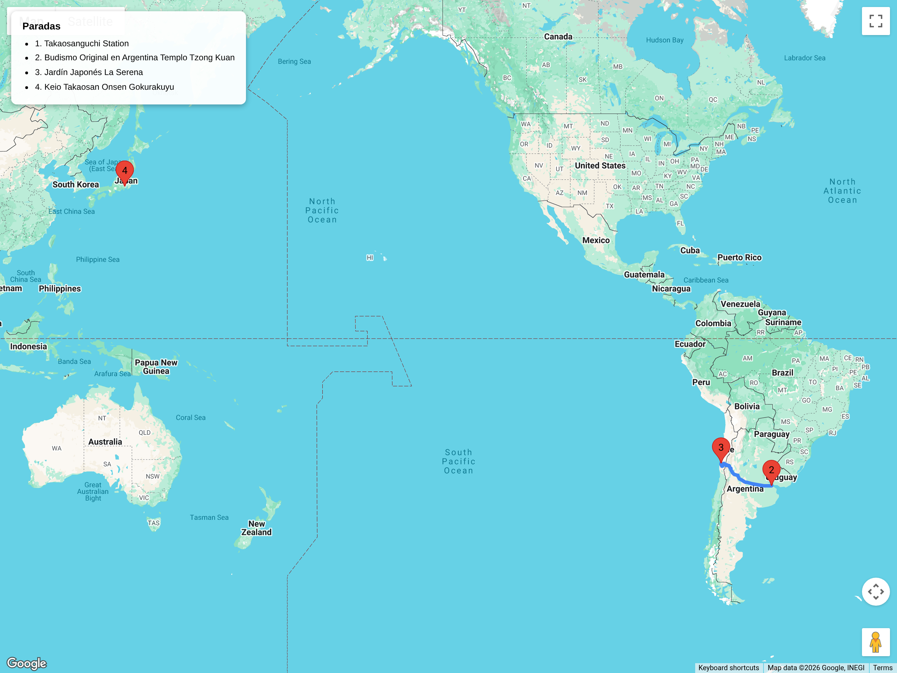

# Bloques de hiking  
## Itinerario: Takao-san (Monte Takao)

---

### Concepto del lugar

El monte Takao es la excursión más popular de Tokio, con 2.6 millones de visitantes al año. A solo 50 minutos de Shinjuku, ofrece templos, naturaleza y vistas al Monte Fuji sin el esfuerzo de los Alpes Japoneses. Es sagrado desde el siglo VIII, con el templo Yakuoin en su ladera y tres cumbres principales. Ideal para iniciarse en el senderismo japonés o para un día relajado con onsen al final.

---

### Estructura general del recorrido

**Shinjuku → Takao-san-guchi → (funicular opcional) → templo Yakuoin → cumbre Takao-san → descenso por ruta alternativa → Takao-san-guchi → onsen opcional**

---

### Transporte y acceso

- **Desde Shinjuku:** Keio Line semi-especial o especial hasta Takao-san-guchi (50 min, ¥390, sin transbordo). El tren más cómodo y directo.
- **Alternativa JR:** Chuo Line hasta Takao (60 min), luego Keio Line 1 parada hasta Takao-san-guchi. Útil si vas con JR Pass.
- **Funicular y teleférico:** Desde la base hasta medio camino. Funicular (cable car) 6 min, teleférico 12 min. Ahorran 40 min de subida empinada. Cuesta ¥490 por trayecto.

### El sendero

- **Distancia:** 3.8 km (ida y vuelta por sendero #1), hasta 7 km si combinás rutas  
- **Duración:** 2–4 horas según ruta y uso de funicular  
- **Dificultad:** Fácil a moderado (599m de altura, sendero bien marcado)  
- **Punto de inicio:** Takao-san-guchi (final de la línea Keio)  
- **Punto alto:** Cumbre de Takao-san (599m), con mirador al Fuji

**Lo que verás:**
- **Templo Yakuoin:** Templo budista de 744 d.C. dedicado a tengu (espíritus de la montaña con nariz larga). Estatuas de tengu protegen el camino.
- **Sendero Omotesando (#1):** La ruta clásica, empedrada, con raíces de cedros expuestas. 800 años de historia.
- **Sendero Inariyama (#6):** Ruta "salvaje" por el bosque, menos concurrida, con Biwa Falls (cascada).
- **Cumbre:** Mirador 360°, monumento a los montañistas, restaurantes de soba y tororo (ñame rallado).
- **Jardín botánico:** Shokubutsu Shizenen al pie de la montaña (entrada paga, ¥440).

### Variantes del recorrido

**Opción fácil (1.5 hs, 3km):**
- Funicular subida → caminar 40 min hasta la cumbre → bajar por sendero #1 o teleférico.
- Ideal para familias con niños o adultos mayores.

**Opción clásica (3 hs, 4km):**
- Subir caminando por sendero #1 (Omotesando) → Yakuoin → cumbre → bajar por sendero #2 o #4.
- Experiencia completa sin funicular.

**Opción naturaleza (4 hs, 7km):**
- Sendero #6 (Inariyama) subida → cascada Biwa → cumbre → bajar por sendero #1.
- Más silencio, menos gente, terreno irregular.

**Opción extendida a Jinba-san (+3 hs):**
- Desde la cumbre de Takao, continuar la cresta hasta Jinba-san (857m) y bajar a Kobotoke.
- Requiere todo el día y mejor condición física.

### Onsen post-caminata

- **Keio Takaosan Onsen Gokurakuyu:** A 5 min caminando de Takao-san-guchi. Onsen moderno con rotenburo (baño al aire libre), saunas y restaurante. ¥1,100. La opción más cómoda.
- **Ashiyu (fuente de pies):** Gratuita junto a la estación Takao-san-guchi, para una parada rápida.

### Consejos prácticos

- **Calzado:** Zapatillas de trekking recomendadas aunque el sendero #1 es accesible con zapatillas comunes. Sendero #6 requiere calzado de trekking.
- **Multitudes:** Evitar fines de semana y días festivos en otoño (noviembre). Llegar antes de las 8:00 para tranquilidad.
- **Agua:** Trae 1L; hay fuentes en Yakuoin y máquinas en la cumbre (precios elevados).
- **Clima:** El Fuji solo se ve con despejado (mejor en invierno y temprano en la mañana). En verano, la montaña es 5°C más fresca que Tokio.
- **Comida:** Bentos en la base; soba en la cumbre (caro, ¥1,000+). Opciones mejores y más baratas en la estación tras bajar.

### Comparativa con Okutama (Tama River Trail)

| Aspecto | Takao-san | Okutama (Tama River) |
|---------|-----------|---------------------|
| Accesibilidad | ⭐⭐⭐ Muy fácil desde Tokyo | ⭐⭐ Requiere 1.5-2 hs |
| Multitudes | Alta (evitar fines de semana) | Baja a moderada |
| Dificultad | Fácil a moderado | Fácil-moderado |
| Experiencia | Cultural + naturaleza | Naturaleza pura |
| Onsen | Excelente opción en base | Limitado |
| Ideal para | Primer hiking en Japón | Escapar de la ciudad |

### Otoño (noviembre)

- **Momiji (arces rojos):** Pico de color entre el 15-30 de noviembre. El sendero #1 se transforma en túnel rojo.
- **Follaje:** Ginkgo, arces japoneses y cedros de la cumbre.
- **Multitudes:** Máximo anual; llegar antes de las 7:00 o ir en día de semana.
- **Temperatura:** 5-10°C en la cumbre; llevar capa.
- **Fuji visibility:** Peor época por nubosidad de otoño, pero las vistas de colores compensan.
- **Eventos:** Momiji Matsuri (festival de otoño) con iluminación nocturna en el templo Yakuoin.

---

**Nota:** Tercer bloque de hiking. Próximo: Hakone (Old Tokaido completo).
