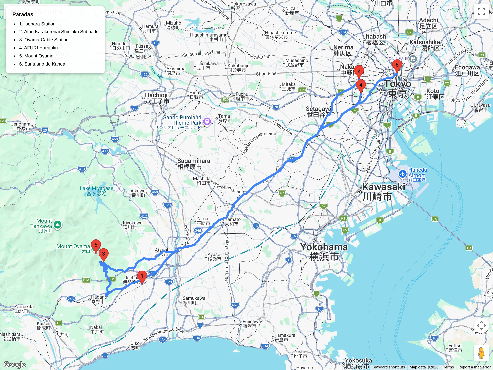

# Bloques de hiking  
## Itinerario: Monte Ōyama (Afuri-jinja) – Isehara, Kanagawa

---

### Concepto del lugar

El monte Ōyama (1,252m) es una de las montañas sagradas más antiguas de Japón, venerada desde la época Heian por su poder de traer lluvia y buenas cosechas. El santuario Afuri (阿夫利神社), dividido en un santuario inferior (Koma-afuri-gū) y uno superior en la cumbre, ha sido destino de peregrinación durante más de mil años. A diferencia del concurrido Takao-san, Ōyama mantiene un aire más tradicional y espiritual, con senderos de piedra antiguos, cedros gigantes y vistas que abarcan desde el monte Fuji hasta la bahía de Tokio. Es una excursión que combina hiking auténtico, historia religiosa y gastronomía local (tofu y soba del monte).

---

### Estructura general del recorrido

**Shinjuku → Isehara (Odakyu) → autobús a Santuario inferior → subida por sendero tradicional (Ōyama-dōri) → Santuario Afuri superior → cumbre → descenso por ruta alternativa → tofu tradicional → Isehara**

---

### Transporte y acceso

- **Desde Shinjuku:** Odakyu Line express (romancecar o local) hasta Isehara (65-80 min, ¥620-930 dependiendo del tren). El romancecar requiere reserva y suplemento (¥310) pero es más cómodo.
- **Desde Isehara a la base:** Autobús Kanachu desde la estación norte hasta "Ōyama Cable" o "Koma-afuri-gū" (30 min, ¥360). Sale cada 30-40 min; el último regreso es temprano (verificar horarios).
- **Alternativa de caminata:** Desde Isehara se puede caminar hasta el santuario inferior (3.5km, 50 min) por una ruta de peregrinación histórica, aunque la mayoría toma el bus para conservar energía para la subida.

### El sendero

- **Distancia:** 6-8 km según ruta (ida y vuelta)  
- **Duración:** 4-6 horas completo (sin contar transporte)  
- **Dificultad:** Moderado (1,252m de altura, sendero empinado con piedras)  
- **Punto de inicio:** Santuario inferior Koma-afuri-gū o base del teleférico  
- **Punto alto:** Cumbre de Ōyama (1,252m), mirador principal junto al santuario superior

**Lo que verás:**
- **Santuario Koma-afuri-gū (inferior):** Santuario colorido dedicado a la protección de viajeros. Hay purificación tradicional y omamori específicos de Ōyama.
- **Cable car opcional:** Teleférico que sube hasta Afuri-jinja (¥690 ida, ¥1,230 ida y vuelta). Ahorra 45 min de subida empinada; último ascenso 16:30, último descenso 17:00 (confirmar horarios estacionales).
- **Sendero Ōyama-dōri:** La ruta clásica de peregrinación, con escalones de piedra desgastados por siglos de uso. Pasarás bajo cedros de 400 años y toriis de piedra.
- **Santuario Afuri superior:** Ubicado en la cumbre, con vistas espectaculares. El edificio principal tiene un diseño único con influencias de la arquitectura sintoísta antigua.
- **Miyatamano-jinja:** Santuario más pequeño en la cumbre dedicado a la protección de la montaña.
- **Tofu-ya:** Puestos tradicionales de tofu frio (tōfu no kadozuke) que se han mantenido desde la época Edo. Es tradición comer tofu con shoyu y jengibre después de bajar.

### Variantes del recorrido

**Opción cable car (3-4 hs, 4km caminados):**
- Cable car hasta Afuri-jinja → corto ascenso final a cumbre → bajar caminando por sendero tradicional.
- Ideal para quienes quieren la experiencia sin el esfuerzo completo.

**Opción clásica de peregrinación (5-6 hs, 7km):**
- Subir caminando desde el santuario inferior por Ōyama-dōri → santuario superior → cumbre → bajar por el mismo sendero o ruta del cable car.
- Experiencia completa de peregrinación tradicional.

**Opción Isehara caminando (6-7 hs, 10km):**
- Caminar desde la estación Isehara hasta el santuario inferior (ruta histórica) → subida a cumbre → descenso completo.
- Para hikers experimentados que quieren maximizar la experiencia.

**Ruta extendida a Tanzawa (+4-6 hs):**
- Desde la cumbre de Ōyama continuar la cresta hacia el monte Sōdantō (1,641m) o monte Hinokiboramaru (1,601m).
- Requiere todo el día, equipamiento de trekking y experiencia. No recomendado para excursiones casuales desde Tokio.

### Gastronomía del monte Ōyama

- **Tofu frio (kadozuke):** La especialidad desde la época Edo. Vendedores en la base y en la cumbre venden tofu cortado en cubos, servido con shoyu, jengibre rallado y wasabi. Refrescante después de la subida.
- **Soba de monte:** Variedad de trigo sarraceno local servido frío (zaru soba) o caliente. Los restaurantes al pie de la montaña son más baratos que en la cumbre.
- **Amazake:** Bebida dulce de arroz fermentado, tradicionalmente ofrecida en santuarios montañeses.
- **Dango:** Bochas de masa de arroz en pinchos, opciones de shoyu dulce o anko.

### Consejos prácticos

- **Calzado:** Obligatorio calzado de trekking. El sendero Ōyama-dōri tiene escalones de piedra irregulares y raíces expuestas; en época húmeda resbalan.
- **Multitudes:** Menos concurrido que Takao-san, pero fines de semana y festivos de otoño (oct-nov) pueden estar llenos. Llegar antes de las 9:00 para tranquilidad.
- **Agua:** Traer 1.5L; hay fuentes en el santuario inferior y máquinas en la cumbre (precios elevados). No hay agua en el tramo cable car-cumbre.
- **Clima:** El Fuji se ve con despejado desde la cumbre (mejor invierno y primavera temprana). La montaña está 8°C más fría que Tokio; llevar capa aunque haga calor en la base.
- **Horarios:** El último autobús de regreso a Isehara suele ser entre 17:00-18:00 según temporada. Verificar horarios en el sitio de Kanachu Bus antes de salir.
- **Peregrinación:** Si querés la experiencia completa, llevá un bastón de madera (kongo-zue) que se vende en la base; es tradición de los peregrinos de Ōyama.

### Comparativa con Takao-san

| Aspecto | Monte Ōyama | Takao-san |
|---------|-------------|-----------|
| Altura | 1,252m | 599m |
| Dificultad | Moderado | Fácil a moderado |
| Multitudes | Moderadas | Altas |
| Accesibilidad | 1.5-2 hs desde Tokio | 50 min desde Tokio |
| Experiencia | Espiritual + hiking | Cultural + naturaleza |
| Cable car | Sí (más corto) | Sí (más largo) |
| Gastronomía | Tofu tradicional, soba | Tororo, soba |
| Ideal para | Hiking serio medio | Primer hiking en Japón |

### Primavera (marzo–abril)

- **Sakura:** Hay algunos cerezos en la base y alrededor del santuario inferior, pero no es el atractivo principal. Mejor ver sakura en otros lugares y venir a Ōyama por el hiking.
- **Clima:** Temperaturas agradables (15-20°C en base, 5-10°C en cumbre). Ideal para hiking antes del calor de mayo.
- **Visibilidad:** Excelente época para ver el Fuji desde la cumbre (cielos despejados de primavera).
- **Rituales:** El santuario Afuri celebra ceremonias de oración por las cosechas en abril; podés ver rituales tradicionales si coincidís.
- **Equipamiento:** Capa impermeable ligera recomendada; marzo puede tener lluvias inesperadas.

---

**Nota:** Cuarto bloque de hiking. Ofrece mayor desafío que Takao-san con recompensas de vistas y tradición espiritual más profundas.
