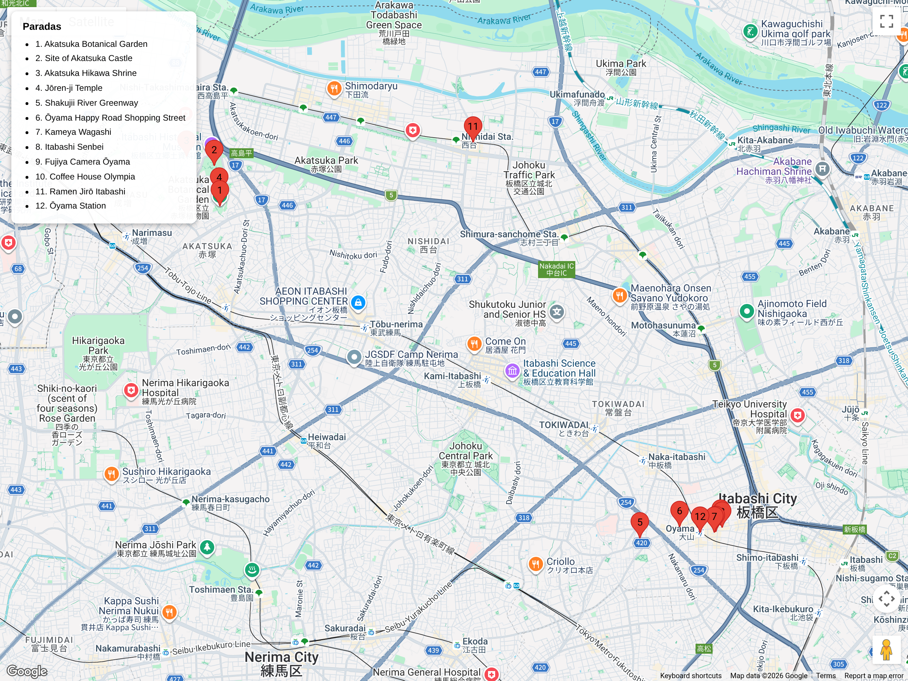

# Bloques urbanos – Cultura local / relajados  
## Itinerario: Itabashi + Ōyama (Día A)

---

### Concepto del día

Bloque centrado en tu base de Itabashi: restos de la Nakasendō, templos de barrio y el shotengai Happy Road. Perfecto para aclimatarse y entender el contexto local.

---

### Estructura general

**Itabashi Station → Nakasendō histórica → Jōren-ji → Ōyama Happy Road Shotengai**

---

### 1. Estación Itabashi

Punto de partida y conexión diaria. Observá el contraste entre el viaducto moderno y las calles laterales que siguen el trazado Edo.

### 2. Restos de Nakasendō (Itabashi-juku)

- Explora las calles que conservan la orientación del antiguo pueblo posta.  
- Fijate en placas explicativas y en las casas bajas que sobrevivieron.  
- Ideal para fotos de tránsito cotidiano (bicicletas, tiendas familiares).

### 3. Jōren-ji (浄蓮寺)

- Templo de la secta Jōdo, muy ligado al pasado de Itabashi.  
- Excelente primer goshuin del viaje.  
- Tranquilo, sin turistas; se puede charlar con los monjes si están disponibles.

### 4. Ōyama + Happy Road Shotengai

- Shotengai cubierto largo, lleno de panaderías, wagashi y tiendas de utensilios.  
- Probá bentos de barrio, senbei o croquetas.  
- Combinalo con cafés pequeños o bares tipo tachinomi al final de la tarde.

### Consejos prácticos

- Ideal para día nublado o inicio de viaje.  
- Caminata corta (todo dentro de 2-3 km).  
- Lleva efectivo para compras chicas.  
- Se puede cerrar con cena en los izakaya de Ōyama o volver a Itabashi según ganas.

### Primavera (marzo)

- Restos de la **Nakasendō** tienen cerezos plantados por vecinos; caminá temprano para verlos con poca gente.  
- **Jōren-ji** arma arreglos florales frente al salón principal y ofrece goshuin con tema sakura durante el equinoccio de primavera.  
- En **Happy Road Ōyama** aparecen puestos temporales con ichigo daifuku y anmitsu estacional: buena merienda antes de volver al alojamiento.
