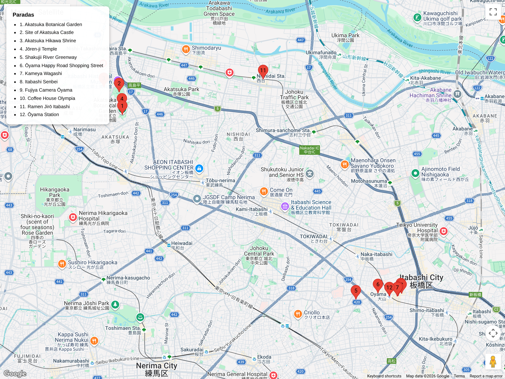

# Bloques urbanos – Cultura local / relajados  
## Itinerario: Itabashi + Ōyama (Día completo)

---




### Concepto del día

Día local profundo en Itabashi: jardín botánico de barrio, ruinas de castillo medieval, paseo ribereño tranquilo y shotengai clásico con negocios específicos de tercera generación. Nada de listas de "que ver en Tokio", esto es barrio real con historia real: la Nakasendō pasaba por acá, los samurai del clan Ōishi controlaban el norte de Edo desde el castillo de Akatsuka, y los comerciantes de Ōyama vendían suministros a los viajeros desde hace 400 años.

---

### Estructura general

**Akatsuka Botanical Garden → Ruinas Castillo Akatsuka → Shakujii River Greenway → Ōyama Happy Road**

Distancia total: ~6 km de caminata suave.  
Ideal para: día de aclimatación, recuperación de jet lag, o escapada de la densidad del centro.

---

### 1. Akatsuka Botanical Garden (板橋区立赤塚植物園)

- **Por qué ir:** Jardín botánico municipal de Itabashi, completamente local. Sin turistas, con invernaderos de colecciones de plantas tropicales y árboles de hoja perenne.
- **Qué hacer:** Invernadero de palmeras y orquídeas, estanque de lotos (florece julio–agosto), arboleda de cerezos silvestres para sakura tranquilo.
- **Dato:** Es más chico que Jindai (Chōfu) pero auténtico de barrio. Vecinos paseando perros y jubilados dibujando plantas.
- **Entrada:** Gratis. Abierto 09:30–17:00, cerrado lunes.

→ **Movimiento:** Salida por la puerta este, caminata de 20 min hacia el este por calles residenciales.

---

### 2. Ruinas del Castillo de Akatsuka y zona histórica

**Ruinas del Castillo de Akatsuka (赤塚城跡):**

- **Por qué ir:** Restos reales de un castillo del siglo XV, sede del clan Ōishi. No queda mucha piedra en pie, pero el parque (Akatsuka Tameike) conserva el foso y la explanada. Placas explicativas en japonés e inglés.
- **Qué hacer:** Subí al montículo central (reconstruido) para ver la geometría defensiva. Fijate en el mapa de la bandera que muestra el dominio original.
- **Contexto:** Este castillo protegía el acceso norte a Edo por la Nakasendō. Cayó antes de la unificación Tokugawa.

**Santuario Akatsuka Hikawa (赤塚氷川神社):**

- Fundado en 1180, uno de los santuarios Hikawa más antiguos de Tokio. El torii de piedra data de 1656.
- El bosque de cedros que lo rodea es remanente del bosque original que cubría la zona del castillo.
- Ofrece *goshuin* escritos a mano; el sacerdote suele estar disponibles hasta las 15:00.

**Takinoiya (滝の井):**

- Pozo histórico de agua cristalina que abastecía al castillo. Sigue funcionando; los vecinos vienen a cargar agua para el té.
- Placa explica que el agua viene del acuífero de Musashino, mismo que abastece parte de Tokio.

→ **Movimiento:** 10 min caminando hacia el sur, bordeando el parque.

---

### 3. Shakujii River Greenway y Nakasendō histórica

**Shakujii River Greenway (石神井川緑道):**

- **Por qué ir:** Paseo ribereño de 3 km entre árboles, completamente local. No hay turistas, hay gente paseando perros y ciclistas de barrio.
- **Qué hacer:** Caminá tranquilo. En marzo los cerezos forman túneles blancos sobre el agua. Hay bancos cada 200 metros para sentarse.
- **Variante:** Si querés acortar, cortá por cualquier puente y tomá bus hacia Ōyama (líneas 赤01 o 赤02).

**Jōren-ji (常蓮寺):**

- Templo Nichiren fundado en 1495, reconstruido en 1750. Jardín zen con piedras dispuestas en forma de tortuga (símbolo de longevidad).
- Ofrece *goshuin* con sello del templo y caligrafía del *Lotus Sutra*.
- El *shakujii* (cetro de hierro) del que toma nombre el río supuestamente está enterrado acá; el templo guarda una réplica del siglo XVII.

**Cruce de la Nakasendō (中山道):**

- La antigua ruta comercial que unía Edo con Kioto pasaba por este punto. Hay una placa de bronce marcando el trazado original.
- Algunas casas de madera de los 50-60 conservan la fachada de tiendas de *hatago* (posadas) que alojaban a los viajeros.

→ **Movimiento:** Seguí el río 2 km hasta el cruce con la Nakasendō histórica, luego 10 min a Ōyama.

---

### 4. Ōyama Happy Road: shotengai con historia

**El shotengai:**

- **Por qué ir:** Shotengai clásico de barrio, cubierto en gran parte, con la arquitectura de los 60-70 intacta. El nombre "Happy Road" viene de una campaña de revitalización de 1965.
- **Longitud:** 800 metros de tiendas contiguas, una de las shotengai más largas de Tokio.

**Tiendas específicas:**

- **Kameya (亀屋):** wagashi tradicional desde 1923. Especialidad: *kintsuba* (dulce de boniato) y *ohagi* (bolas de arroz con azuki). El dueño actual es la cuarta generación; usa la misma receta de anko que su bisabuelo.
- **Itabashi Senbei (板橋煎餅):** senbei recién hechos en plancha de hierro visible desde la calle. El aroma de salsa de soja tostada se siente a media cuadra. Probar el *nori senbei* (con alga) recién salido.
- **Maruetsu (マルエツ):** supermercado local que parece de los 80. Sección de *bento* caseros hechos por vecinas; llegar antes del mediodía.
- **Fujiya Camera (フジヤカメラ):** tienda de fotografía analógica que sobrevivió a la digital. Venden rollo, hacen revelado C-41 en 24 hs, y tienen cámaras usadas a precios razonables.
- **Ōyama Shotengai Information Center:** oficina de información con mapas del barrio. A veces tienen folders en inglés sobre la historia de la zona.

**Cafés y kissaten:**

- **Coffee House Olympia (コーヒーハウスオリンピア):** kissaten de 1968, mobiliario original de formica naranja. Sifón de cristal, café ~400 yen. El dueño tiene 82 años y abre todos los días.
- **Café de l'Ambre (カフェ・ド・ランブル):** no confundir con el famoso de Ginza; este es local de barrio con aire francés. Café de tueste medio, *chiffon cake* casero.
- **Hidamari (ひだまり):** café de especialidad más nuevo (2015), tostadores de Saitama. Ambiente de madera clara, buen *pour over*.

**Comida específica:**

- **Yakisoba Itabashi (板橋焼きそば):** estilo local, fideos gruesos de trigo, salsa dulce base de *tonkatsu*, repollo abundante. Dos casas en el shotengai:
  - **Marumi (丸美):** desde 1954, sartén de hierro de 70 años. Porción grande, ambiente de tachinomi.
  - **Ōyama-ya (大山家):** versión más moderna, opción con *mochi* encima. Local familiar.
- **Ramen Jirō Itabashi (ラーメン二郎 板橋店):** sucursal de la cadena icónica. Porciones masivas, cola casi segura. Reglas: pedir rápido, comer rápido, no hablar por celular.
- **Toriyoshi (鳥良):** izakaya de cadena pero con sabor local. *Yakitori* hecho en parrilla de carbón, *tsukune* (albóndigas de pollo) son la especialidad.
- **Tachinomi Ōyama (立呑み大山):** bar de pie sin nombre oficial, todos lo conocen así. Cerveza tirada, *otsumami* variados, ambiente de obreros jubilados y músicos locales. Abre desde las 15:00.

**Dulces y postres:**

- **Anmitsu Mihashi (あんみつみはし):** sucursal de la cadena famosa de Ueno. *Anmitsu* con *kuromitsu* (salsa de azúcar negro) casera.
- **Ōyama Manjū (大山まんじゅう):** tienda pequeña, *manjū* de *koshian* recién hechos. Venden en packs de 3 o 5.

**Noche:**

- Si es de noche, los *tachinomi* entre Happy Road y la estación de Ōyama abren desde las 17:00. Buscar el de la cortina roja; no tiene nombre pero tiene la mejor selección de *shōchū* de batata.

---

### Consejos prácticos

| Aspecto | Detalle |
|---------|---------|
| **Transporte** | JR Itabashi o Metro Itabashi-Kuyakushomae para empezar; Metro Ōyama para terminar (o viceversa). |
| **Duración** | 6–8 horas sin apuro (versión extendida). |
| **Calzado** | Zapatillas cómodas, todo es plano. |
| **Efectivo** | Sí, el jardín botánico (si hay entrada), templos y tiendas del shotengai son cash-only o preferen efectivo. |
| **Baños** | Disponibles en Akatsuka Botanical Garden, parque Akatsuka, templo Jōren-ji, y varios dentro del shotengai. |
| **Inglés** | Mínimo. Usá gestos y Google Translate. |

### Alternativas según energía

- **Día corto (3 horas):** Castillo Akatsuka + Ōyama directo (omití jardín y río).
- **Día extendido:** Agregá **Akatsuka Hikawa-jinja** al inicio y **Kawaguchi** al final (cruzando el río Arakawa, 20 min extra).
- **Lluvia:** Quédate en tiendas cubiertas de Ōyama Happy Road (shotengai techado).
- **Día de templo:** Agregá **Gōtoku-ji** (templo del gato de la suerte, maneki-neko) a 15 min en bus desde Ōyama.

### Primavera (marzo–abril)

- **Akatsuka Botanical Garden:** Cerezos silvestres, floración más tardía que los somei yoshino. Ideal para picnics sin gente.
- **Shakujii River:** Sakura lineal sobre el agua, pétalos cayendo en la corriente. Ideal para fotos a las 7–8 am sin gente.
- **Santuario Akatsuka Hikawa:** El shidarezakura (cerezo llorón) del patio central tiene más de 100 años; florece una semana después que los somei yoshino.
- **Ōyama:** Puestos temporales de *ichigo daifuku* y *sakura mochi* en el shotengai. Algunos tachinomi ponen *noren* con motivos florales.
- **Jōren-ji:** Abre el jardín trasero solo durante la primera semana de abril; tiene azaleas de la era Meiji en flor.

### Mapa de puntos clave

```
Akatsuka Botanical Garden
       ↓ (20 min)
Castillo Akatsuka → Akatsuka Hikawa-jinja → Takinoiya
       ↓ (10 min)
Shakujii River Greenway → Jōren-ji → Cruce Nakasendō
       ↓ (caminata 2 km)
Ōyama Happy Road (Kameya, Olympia, Marumi, Tachinomi)
```

---

**Nota:** Este bloque reemplaza completamente la versión anterior. Itabashi tiene más historia y naturaleza de lo que parece en las guías turísticas. Es barrio residencial real, no escenografía. La combinación de castillo medieval, ruta Edo-periodo, y shotengai de posguerra hace un día completo de capas históricas distintas.
