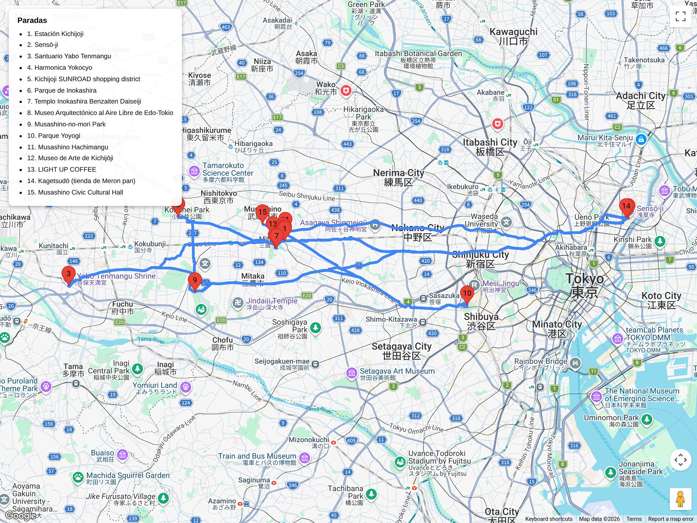

# Bloques urbanos – Cultura local / relajados  
## Itinerario: Kichijōji + Inokashira Park

---

---

### Concepto del lugar

Barrio querido por los tokiotas para vivir: shotengai animados, templos discretos, arquitectura histórica preservada y un parque central con lago.  
Este itinerario equilibra gastronomía local, espacios culturales y naturaleza accesible sin salir de la ciudad.

---

### Estructura general del recorrido

**Kichijōji Station → Templo Gessō-ji → Santuario Yabo Tenmangū → Harmonica Yokocho → Sun Road → Inokashira Park → Edo-Tokyo Open Air Architectural Museum (opcional) → cena en izakaya**

---

### Templos y espacios espirituales

- **Gessō-ji** (templo Nichiren, 10 min a pie de la estación): fundado en el siglo XIV, jardín compacto y silencioso.  
  - Goshuin disponible; en abril florecen los wisteria.  
  - Ideal para empezar el día sin multitudes.
- **Santuario Yabo Tenmangū** (15 min a pie): dedicado a Tenjin (deidad del estudio), conocido por su túnel de ginkgo en otoño.  
  - Camino de acceso que atraviesa barrios residenciales silenciosos.  
  - Pequeño estanque con koi y puente vermellón.
- **Musashino Hachimangū** (opcional, 20 min desde el parque): santuario shinto tradicional con torii de piedra y bosquecillo de cedros.

### Arquitectura y patrimonio

- **Edo-Tokyo Open Air Architectural Museum** (15 min en bus desde Kichijōji Station):  
  - Casas samurái reconstruidas, farmacia Meiji, baños públicos Taishō, sala de cine Showa.  
  - Paseo al aire libre por 7 hectáreas; ideal para 90-120 min.  
  - Permite fotos en interiores; buena introducción a la vida doméstica histórica antes de ver templos.
- **Casa de la Cultura de Musashino** (cerca del parque): arquitectura brutalista de los 60 con exhibiciones rotativas de arte local; entrada libre.

### Naturaleza y parques

- **Inokashira Park**:  
  - Lago con alquiler de botes cisne y remeros (llegar antes de las 10:00 para evitar filas).  
  - Santuario Inokashira Benzaiten en la isla central; goddess of music and arts.  
  - Senda de sakura bordeando el agua; en primavera hay puestos de sake frío.  
  - **Reserva Natural de Musashino** (zona norte del parque): 40 hectáreas de bosque nativo, senderos sin pavimentar, avistaje de aves.
- **Parque de la Amistad Japón-India**: jardín zen pequeño con pagoda donada por la India; raro en Tokio, 10 min a pie del lago.

### Shotengai y vida diaria

- **Sun Road** (North Exit): arcada techada con tiendas de utensilios, moda indie y supermercados locales.  
  - Pará en **Tokyu Hands** (sección básica) o tiendas de cerámica japonesa.
- **Harmonica Yokocho**: callejón de izakayas micro desde los 50.  
  - Ideal para fotos de día; vuelve de noche para atmósfera auténtica (cover 300-500¥).

### Cafés, postres y comida

- **Light Up Coffee**: tostado artesanal, ediciones de temporada (sakura en marzo/abril).  
  - Ambiente minimalista; bueno para llevar al parque.
- **Lon Café**: especialidad en soufflé pancakes; espera típica 15-20 min.
- **Floresta**: donuts naturales con formas de animales; pedí el de gato o conejo.
- **Satou**: melón-pan relleno de carne (carrillera); fila constante pero rápida.
- **Shiawase no Pancake**: nubes esponjosas; ideal para merienda post-parque.
- Cena: izakaya en Harmonica Yokocho o **Iseya** (yakitori histórico en Sun Road desde 1927).

### Opciones culturales adicionales

- **Museo de Arte de Kichijoji**: colección moderna japonesa, entrada económica; 10 min desde la estación.  
  - Tienda de souvenirs con obras de artistas locales.
- **Inokashira Park Zoo**: pequeño, 30-45 min; pandas y animales locales de Musashino.  
  - Cerca del santuario Benzaiten; bueno para niños.
- Tiendas de vinilos y cámaras analógicas en calles laterales de Sun Road (buscá "Camera People" o "Disk Union").

### Consejos prácticos

- Llegada: JR Chūō línea rápida o Keio Inokashira (esta última deja en entrada sur del parque).  
- Ideal empezar 09:00-09:30 para templos → museo al aire libre → parque → comida.  
- Efectivo esencial para Harmonica Yokocho y puestos de comida.  
- Bus al museo: línea 52, 53 o 63 desde la estación hasta "Edo-Tokyo Tatemono-en" (20 min).  
- Si no querés museo, reemplazalo por más tiempo en la Reserva Natural de Musashino (senderos más silvestres).

### Primavera (finales de marzo)

- **Inokashira Park** es top 3 de sakura en Tokio: lago rodeado de cerezos, reflejo en el agua.  
  - Los botes cisne se alquilan desde 09:00; cola larga desde las 10:00.  
- Harmonica Yokocho cuelga linternas de hanami; ambiente festivo desde atardecer.  
- Gessō-ji tiene wisteria en abril (segunda quincena).  
- Muchas cafeterías lanzan menús de fresa y sakura; probá los daifuku en **Satou**.
