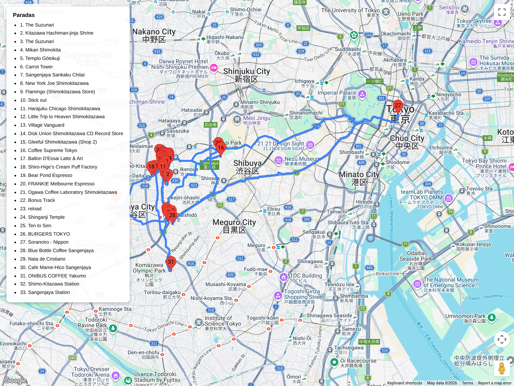

# Bloques urbanos – Cultura local / relajados  
## Itinerario: Shimokitazawa + Sangenjaya

---

### Concepto del lugar

Dos barrios conectados por la línea Setagaya que guardan historia cultural real: Shimokitazawa como cuna del teatro underground japonés desde los 60, y Sangenjaya como punto de paso obligado del antiguo Tamagawa-dō, el camino que unía Edo con Kawasaki desde el siglo XVII. Hoy conviven pasajes residenciales de los 70, templos que sobrevivieron a la modernización, y bares que fueron refugio de obreros y artistas junto a tiendas vintage y cafés de tercera ola que ocupan esos mismos espacios históricos.

---

### Estructura general del recorrido

**Mañana (10:00-14:00): Shimokitazawa Station → teatro histórico → tiendas vintage + santuario → cafés Suzunari y tercera ola → Bonus Track / reload.**  
**Tarde (14:00-17:00): línea Setagaya (tranvía histórico) → templo Shakuhon-ji → Carrot Tower → cafés Sangenjaya.**  
**Noche (17:00 en adelante): Sankaku Chitai (bares históricos) → izakaya de locales.**  
La conexión entre barrios es la línea Setagaya, tranvía operando desde 1925 con coches vintage.

---

### Shimokitazawa: teatro underground, vintage y escala humana

**Historia y cultura:**

- **Teatro Geki Underground (劇地下)** o **Suzunari (すずなり)**: desde los años 60 Shimokitazawa fue epicentro del movimiento *angura* (teatro underground). Los pasajes bajo las vías albergaron grupos como Jōkyō Gekijō que rompían con el shingeki tradicional. Suzunari sigue activo; consultá programación previa o al menos mirá la fachada de los 70.  
- **Santuario Kitazawa Hachiman (北澤八幡神社)**: fundado en 1090, reconstruido en 1616 tras el terremoto de Keichō. Es uno de los pocos espacios sagrados que sobrevivieron a la densificación de los 70. Pedí *goshuin* y mirá el contraste entre el *torii* de piedra y los edificios de apartamentos que lo rodean.  
- **Café Suzunari**: abierto desde 1969, mantiene mobiliario original de madera oscura y ventanales hacia la calle. Es café de vecinos, no de turistas.  
- **Pasajes residenciales**: caminá por las calles al sur de la estación (zona Mikan-Shimokita). Calles estrechas de los 70 con casas unifamiliares de dos pisos, muchas convertidas en ateliers. La escala es única en Tokio.

**Tiendas vintage y vinylos:**

- **New York Joe Exchange**: ropa usada curada en local de los 80, precios accesibles.  
- **Flamingo**: americana vintage de los 50-70, selección de chamarras y jeans.  
- **Stick Out**: outlet vintage por peso, bucear requiere paciencia.  
- **Chicago**: cadena con sucursal grande acá, stock masivo organizado por década.  
- **Haight & Ashbury**: especializado en rock/punk de los 70-80, bandas japonesas.  
- **Village Vanguard**: libros, vinilos y curiosidades, local icónico de la zona.  
- **Disk Union**: vinilos de jazz, rock y música japonesa usada.  
- **Free Culture**: vinilos baratos y CDs usados, buena sección de city pop.

**Cafés y dulces:**

- **Coffee Supreme**: tostadores neozelandeses, latte art consistente.  
- **Ballon d'Essai**: café de especialidad con vista a la calle, tueste ligero.  
- **Shiro-Hige Cream Puff Factory**: único lugar oficial de Totoro cream puffs (*shu cream*).  
- **Bear Pond Espresso**: espresso intenso, ambiente minimalista, barista conocido en la escena.  
- **Frankie Melbourne Espresso**: australiano, buenos flat whites.  
- **Sawada Coffee**: local pequeño, barista premiado en competencias.

**Espacios creativos y comida:**

- **Bonus Track**: callejón bajo las vías con editoriales indie, tiendas efímeras y comida experimental. Empezó como proyecto de reurbanización 2019.  
- **reload**: espacio nuevo bajo las vías (2020) con talleres, tiendas efímeras y cafés.  
- **Shinryuji Daikanjin (心龍寺大勧進)**: pequeño templo escondido entre edificios, ofrece *goshuin* personalizado.  
- **Ten to Sen**: curry casero con vegetales locales, ambiente de madera.  
- **Oh!Way**: hamburguesas hechas en plancha con cebolla caramelizada.  
- **Soranoiro**: ramen vegano y de verduras, único menú sin carne.

### Sangenjaya: el camino del Tamagawa y cultura de posguerra

**Historia y templos:**

- **Templo Hōdō-san Shakuhon-ji (法道山 積本院寺)**: fundado en 1333 por el monje Nisshin. Templo Hokke que albergó ermitas hasta el siglo XIX. Puerta de madera y jardín zen originales de la reconstrucción de 1952. Abre hasta las 16:00.  
- **Ruta del Tamagawa-dō (玉川道)**: antes de la línea Den-en-toshi, este camino real conectaba Edo con Kawasaki y el río Tama desde el siglo XVII. En Sangenjaya se cruza con la Nakahara Kaidō. Caminá hacia el oeste por la calle principal y buscá placas de bronce marcando la ruta; algunos edificios de madera de los 50 todavía resisten.

**Arquitectura y vistas:**

- **Carrot Tower (キャロットタワー)**: edificio de 1996, mirador gratis piso 26. Reemplazó viviendas obreras de posguerra. Desde arriba se ve la diferencia de escala: Sangenjaya bajo y denso vs. el horizonte de Shibuya. Si hay día despejado se ve el Fuji.  
- **Línea Setagaya**: tranvía operando desde 1925, coches de los 80 con diseño retro. Única línea de tranvía de Tokio. Viaje Shimokitazawa-Sangenjaya: 10 minutos, tarifa fija. Usá Suica/Pasmo.

**Cafés y dulces:**

- **Blue Bottle Sangenjaya**: café de especialidad californiano, ambiente minimalista.  
- **Nata de Cristiano**: pasteles de nata portugueses, especialidad de la casa.  
- **Café Mame-Hico**: cadena de café de especialidad con buena selección de granos.  
- **Onibus Coffee**: tostadores locales, barra larga con vista a la calle.

**Sankaku Chitai: bares que sobrevivieron a la burbuja:**

- **Sankaku Chitai (三角地帯)**: laberinto de callejones que formó un triángulo entre tres avenidas. Empezó como mercado negro de posguerra, se convirtió en zona de bares para obreros de la fábrica de cerveza Ebisu, y después en refugio de artistas de los 70.  
- Los bares son minúsculos (4-6 personas), muchos abrieron en los 60 y 70. No son temáticos para turistas: son bares de *locals*. Algunos tienen *kayōkyoku* (música de bar tradicional) en el tocadiscos.  
- Reglas: no hay lista de "los mejores". Entrá al que tenga luz tenue y carteles de *shōchū* en la ventana. Pedí *moriawase* (mix de yakitori) y birra o *highball*. No saques fotos sin preguntar.

### Consejos prácticos

- El teatro Suzunari cierra los lunes; consultá funciones en http://suzunari.com.  
- La línea Setagaya es tranvía: se abren puertas manuales en algunos coches (botón o manija).  
- Muchos locales vintage abren 11:00-12:00; programá la mañana suave.  
- Respetá las filas frente a tiendas populares (max 30 min en fines de semana).  
- Sankaku Chitai arranca a las 17:00; antes está cerrado y parece abandonado.  
- Shakuhon-ji cierra a las 16:00; llegá antes de las 15:00 para ver el jardín con luz.  
- Shimokitazawa cambió mucho desde 2015 con la reurbanización de las vías; los pasajes al sur de la estación son lo que queda de la escala original.

### Primavera (marzo-abril)

- En el santuario Kitazawa Hachiman hay un cerezo *shidarezakura* (llorón) de más de 80 años; florece una semana después que los *somei yoshino* de la ciudad.  
- El teatro Suzunari organiza *yozakura* nocturna en su patio durante el hanami; gratuito pero con cupo limitado.  
- Shakuhon-ji abre el jardín trasero solo durante la primera semana de abril; tiene azaleas de la era Meiji.  
- **Bonus Track** organiza mercados al aire libre durante fines de semana de hanami (música + comida); revisá su Instagram para fechas.  
- La vista desde **Carrot Tower** muestra el Fuji con nieve mientras los barrios bajos están verdes: apuntá al atardecer despejado.
