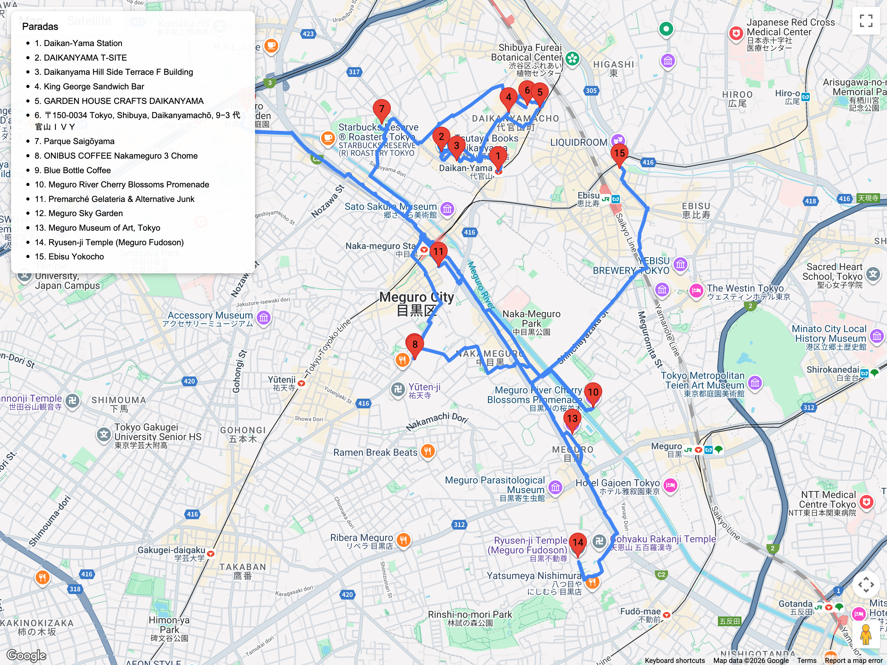

# Bloques urbanos – Cultura local / relajados  
## Itinerario: Daikanyama + Nakameguro + Meguro River

---

### Concepto del lugar

Ruta de diseño contemporáneo, cafés con estilo y paseo ribereño. Ideal para días de clima agradable y para buscar postres cuidados.

---

### Estructura general del recorrido

**Daikanyama Station → T-Site / cafés → Hillside Terrace → caminata a Nakameguro → Meguro River → Naka-me depachika → terminar en Meguro Station o Ebisu**

---

### Daikanyama sofisticado

- Empieza en **Daikanyama T-Site** (Tsutaya): librerías, Starbucks Reserve, tiendas de bicicletas.  
- Pasea por **Hillside Terrace** y boutiques como **Okura**, **45R**, **Maison Kitsuné**.  
- Cafés/postres: **King George** (sandwiches), **Garden House Crafts**, **Ivy Place** (pancakes).  
- Templo urbano: **Saigōyama Park** y su mirador.

### Nakameguro y el río

- Baja por la avenida Komazawa hasta llegar al río Meguro.  
- Sigue la ribera en ambos sentidos: sakura espectacular en finales de marzo, luces navideñas en invierno.  
- Tiendas indie: cerámica japonesa, galerías, plantas (Green Thumb).  
- Cafés: **Onibus Coffee**, **Blue Bottle**, helados en **Premarché Gelateria**.

### Meguro River y alrededores

- Continúa hacia Meguro Station para visitar **Meguro Sky Garden** (parque elevado).  
- Opcional: **Museo de Arte Meguro** o el templo **Ryūsen-ji (Meguro Fudō)** para goshuin y fuego ritual.  
- Finaliza en Ebisu Yokocho si querés cena animada.

### Consejos prácticos

- Lleva zapatos cómodos para caminar largo.  
- Sakura: llega temprano (8:00) o tarde noche para evitar multitudes.  
- Muchas cafeterías aceptan tarjeta, pero los puestos temporales solo efectivo.  
- Ideal para comprar regalos gastronómicos (mantequillas, chocolates, sake artesanal).

### Primavera (pico: última semana de marzo)

- El **Meguro River** se ilumina de noche; si querés fotos sin empujones, caminá por los laterales menos populares (entre Nakameguro y Ikejiri).  
- Daikanyama T-Site monta mercados al aire libre con flores y panaderías; revisá su agenda para sumar degustaciones.  
- Las cafeterías ofrecen bebidas de temporada (sakura latte, kombucha floral); buen break cuando la caminata ya se siente larga.
