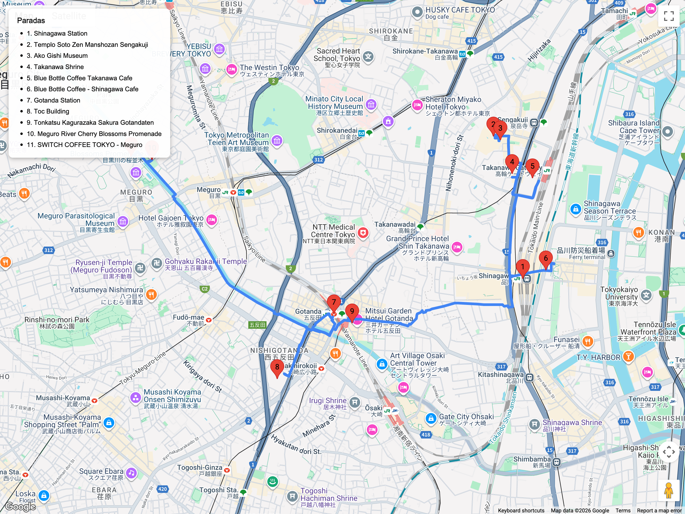

# Bloques urbanos – Cultura local / relajados  
## Itinerario: Takanawa + Sengakuji + Gotanda

---

### Concepto del lugar

Un bloque para explorar el sur de Tokio entre estaciones del Tōkaidō: templos samuráis, barrios residenciales discretos y zonas ferroviarias antiguas. Ideal para día nublado o después de actividades en Shinagawa.

---

### Estructura general del recorrido

**Shinagawa Station (Takanawa Exit) → Sengakuji → Takanawa backstreets → Gotanda shotengai → Meguro River (tramo sur)**

---

### Sengakuji y los 47 rōnin

- A 10 min caminando desde Shinagawa; visita el templo **Sengakuji** donde se encuentran las tumbas de los rōnin.  
- Compra incienso y colócalo frente a las lápidas; pide goshuin con sello especial.  
- Museo pequeño explica la historia de Ako y la venganza de los rōnin.

### Takanawa residencial

- Pasea por las colinas de Takanawa: embajadas, colegios católicos, mansiones antiguas.  
- Cafés escondidos: **Takanawa Coffee**, **Blue Books Café**.  
- Visita el santuario **Hachiman-jinja Takanawa** para otro goshuin y vistas al puerto.  
- Busca restos del antiguo **Takanawa Gateway** y los muros de la línea Tokaido original.

### Gotanda & Meguro River sur

- Camina o toma una parada en la línea Asakusa hasta Gotanda.  
- Shotengai recomendados: **Gotanda TOC** (outlet retro) y **Sakura-dori** con izakaya de salaryman.  
- Pasea por el tramo sur del Meguro River (menos congestionado) hasta Osaki o Fudomae.  
- Final relajado: explorá cafeterías de Gotanda (por ejemplo, **Switch Coffee** o **Cafe du LIEN**) antes de volver a la base; no hay necesidad de onsen si no te interesa.

### Consejos prácticos

- Perfecto para combinar con llegada / salida via Shinagawa shinkansen.  
- Lleva calzado cómodo: hay pendientes fuertes y escaleras.  
- Respeta zonas residenciales (volumen bajo, especialmente noche).  
- Aprovecha para comprar ekiben exclusivos en Shinagawa antes o después del recorrido.

### Primavera (marzo-abril)

- **Sengakuji** decora las tumbas de los rōnin con flores frescas; ve temprano para ver el ritual matutino.  
- Las colinas de Takanawa tienen jardines privados con sakura visibles desde la calle; caminá con calma por las pendientes para absorber la atmósfera.  
- Gotanda y el tramo sur del Meguro River ofrecen un hanami más silencioso que Nakameguro, ideal para tardes laborales.
