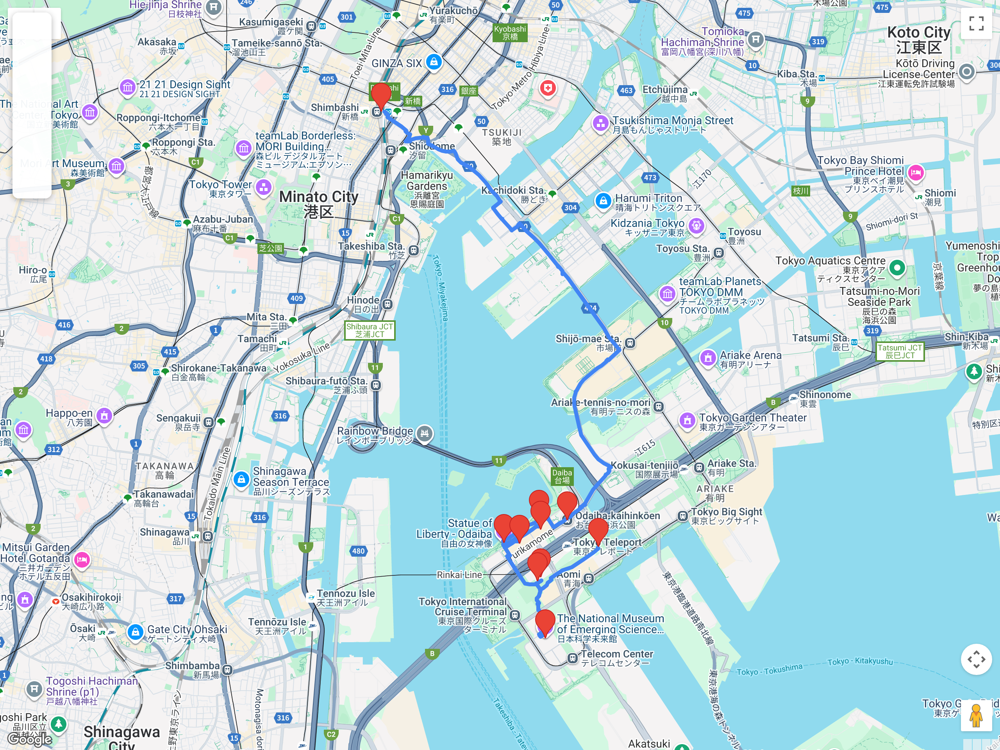

# Bloques urbanos – Cultura local / relajados  
## Itinerario: Odaiba + bahía de Tokio

---

### Concepto del lugar

Odaiba es la “Tokio futurista” sobre tierra ganada al mar: paseo costero, skyline, centros comerciales temáticos y museos modernos. Es un bloque relajado, con muchas pausas, ideal para balancear días históricos o caminatas intensas.

---

### Estructura general del recorrido

**Shimbashi/Toyosu → Odaiba-kaihinkoen → parque costero + estatua de la Libertad → Decks / Aqua City → DiverCity (Gundam) → Miraikan (opcional) → atardecer en la bahía → regreso**

---

### Llegada y primer tramo costero

- Entrá por **Yurikamome** (desde Shimbashi) o por **Rinkai Line** (desde Osaki/Ikebukuro) según dónde estén alojados.  
- Bajate en **Odaiba-kaihinkoen** para empezar por el borde de agua.  
- Caminá el **Odaiba Seaside Park** con vista al Rainbow Bridge y al skyline de Shiodome.

### Zona comercial con vista (Decks + Aqua City)

- **Decks Tokyo Beach** tiene terrazas y miradores; usalos para fotos sin multitudes.  
- **Aqua City** funciona como pausa techada; hay restaurantes con vista a la bahía.  
- Si llueve, este tramo te permite seguir el bloque sin complicaciones.

### DiverCity + Gundam

- **DiverCity Tokyo Plaza** concentra tiendas y el **Gundam** a escala real.  
- Las mejores fotos son al atardecer cuando se encienden las luces del puente y el frente costero.

### Miraikan (opcional)

- El **Miraikan** (Museo de Ciencia y Tecnología) es ideal si querés una sección más educativa.  
- Dedicale 60–90 min si entran; si no, saltealo y quedate en el paseo costero.

---

### Consejos prácticos

- Odaiba se disfruta lento: planificá pausas de café y descansos frente al agua.  
- Evitá horarios muy tarde si querés transporte fluido (el Yurikamome baja frecuencia por la noche).  
- Llevá capa cortaviento: la bahía suele tener brisa fuerte.

### Primavera (marzo-abril)

- El parque costero tiene **sakura** dispersa; no es el punto más fuerte, pero suma aire limpio y menos gente.  
- Aprovechá el atardecer temprano para la foto “bahía + puente + skyline”.  
- Entre semana hay menos familias: mejor para caminar tranquilo.

### Cómo usar este itinerario

- Si el día viene cargado, recortá a **parque + Decks/Aqua City + DiverCity** y listo.  
- Si buscan más cultura, sumá **Miraikan** y estiren el bloque hasta el atardecer.
