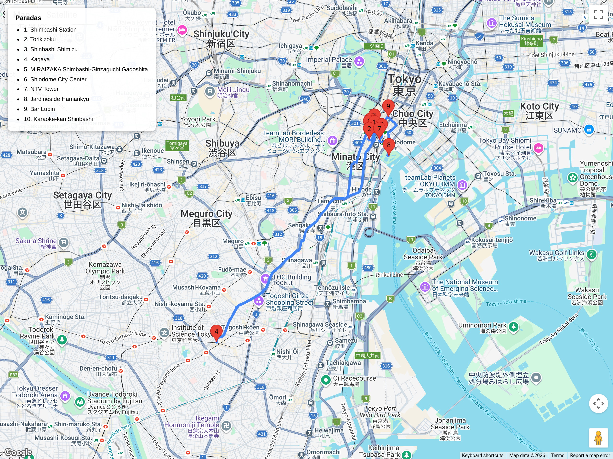

# Bloques urbanos – Cultura local / relajados  
## Itinerario: Shimbashi + Shiodome (Día B)

---

### Concepto del día

Shimbashi es la cuna del ferrocarril japonés y el corazón palpitante de la cultura *salaryman*. Bajo las vías del JR, cientos de izakayas y *tachinomiya* (bares de pie) reciben a oficinistas que desconectan del día con cerveza y *kushikatsu*. A pasos de allí, Shiodome ofrece un contraste brutal: rascacielos de vidrio, parques elevados y la torre de Nippon TV. Este bloque atraviesa tres eras de Tokio: el ferrocarril Meiji, el Japon Inc. de los 80s y el futuro neón de Shiodome.

---

### Estructura general

**Shimbashi Station → SL Plaza → Gado-shita izakayas → Shiodome → Hamarikyu (opcional) → Noche de *salaryman***

---

### 1. Shimbashi Station + SL Plaza

- La estación es histórica: aquí partió el primer tren de Japón en 1872 (línea Shimbashi-Yokohama).  
- La locomotora C11 292 (vapor) en SL Plaza es un símbolo del barrio.  
- Mirá los relieves en el piso que marcan la antigua línea; es un museo al aire libre.

### 2. Gado-shita (izakayas bajo las vías)

- El área *gado-shita* (bajo las vías) concentra más de 100 locales en pocas cuadras.  
- Cada izakaya tiene capacidad para 8-15 personas; la atmósfera es ruidosa, íntima y auténtica.  
- Ideal para almuerzo temprano o primera ronda de la noche.

**Recomendados:**
- **Torikizoku Shimbashi**: cadena familiar, todo a 370¥, *yakitori* consistente.  
- **Shimbashi Shimizu**: clásico de *salarymen*, pescado del día en la barra.  
- **Kagaya**: izakaya temático de * trains*, decorado con memorabilia ferroviaria.

### 3. Shiodome City Center + Nippon TV Tower

- Cruzá la autopista: pasás del siglo XIX al XXI en 200 metros.  
- La Torre de Nippon TV (1956, remodelada) tiene mirador gratis en el piso 32.  
- Los jardines elevados de Shiodome son perfectos para descansar con vistas al distrito.

### 4. Hamarikyu Gardens (opcional)

- Si te queda energía: jardín de los shogun Tokugawa junto a la bahía.  
- Contraste entre jardín Edo y rascacielos de Shiodome al fondo.  
- Requiere entrada (~300¥); cerrado temprano (17:00).

### 5. Noche: *Salaryman* Experience

- Después de las 18:00, Shimbashi muta: los oficinistas invaden las calles.  
- La cultura *nomikai* (borrachera de grupo) es observable desde cualquier esquina.

**Ruta recomendada:**
1. Empezá en un *tachinomiya* (bar de pie) para una cerveza rápida.  
2. Pasá a un izakaya de *kushikatsu* para picar.  
3. Cerrá en un bar de *whisky highball* o karaoke de los 80s.

**Bares históricos:**
- **Kakkouchin**: *tachinomiya* clásico desde 1965, atendido por la tercera generación.  
- **Bar Lupin**: abierto en 1928, legendario entre escritores y periodistas (reservá con tiempo).  
- **Shimbashi Karaoke Kan**: karaoke *Showa* con cabinas retro y catálogo de enka.

### Consejos prácticos

- Llegá antes de las 17:30 si querés lugar en los izakayas populares; después es imposible sin espera.  
- Los *tachinomiya* no tienen sillas: es pie y cerveza, nada más.  
- Muchos locales solo aceptan efectivo; llevá billetes de 1000¥ listos.  
- Conexión simple: Yamanote, Ginza, Asakusa y Oedo líneas pasan por Shimbashi.

### Primavera (marzo)

- El SL Plaza suele tener exhibiciones temporales de sakura en miniatura; chequeá los paneles laterales de la locomotora.  
- Shiodome tiene varios cerezos en los jardines elevados; florecen 3-5 días antes que el promedio de Tokio por el calor urbano.  
- Los izakayas de *gado-shita* sacan menús de *sakura-ebi* (gamba sakura) y *takenoko* (brote de bambú) en marzo; preguntá por el *osusume*.
