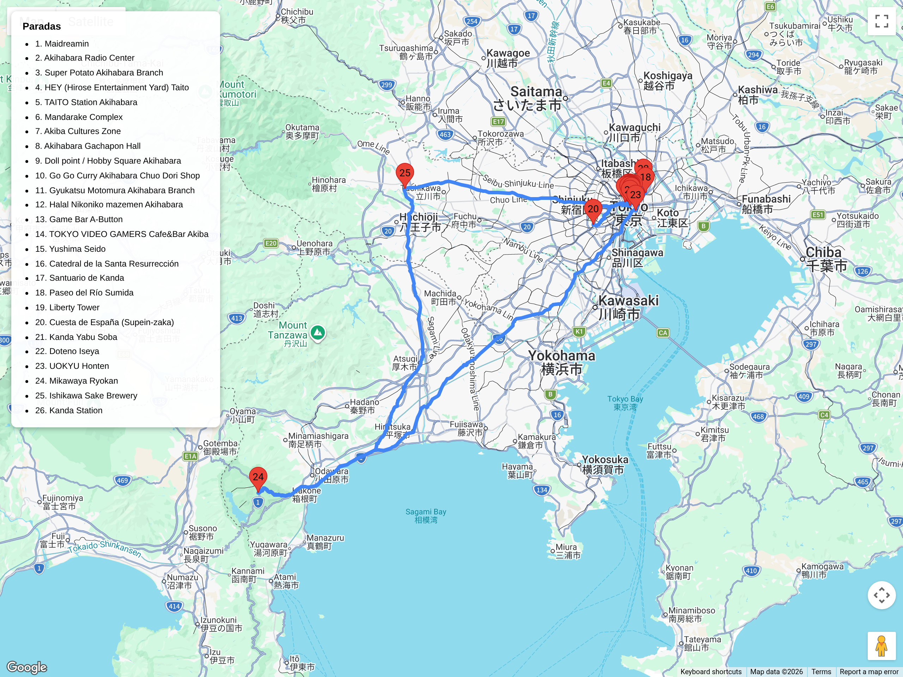

# Bloques urbanos – Subcultura / Retro / Pop  
## Itinerario: Akihabara + Kanda

---

### Concepto del lugar

Día dual: mañana de inmersión total en cultura otaku, electrónica retro y arcades; tarde de descubrimiento cultural en Kanda con templos milenarios, arquitectura religiosa única y paseos fluviales. De lo friki a lo sublime en 20 minutos a pie.

---

### Estructura general del recorrito

**Mañana Akihabara:** Electric Town → Radio Center → retro gaming → arcades → cafés temáticos  
**Tarde Kanda:** Yushima Seidō → Nicholai-do → Kanda-jinja → paseo Kandagawa → izakayas históricos

---

## Akihabara: Electric Town (mañana)

### Electrónica retro y componentes

- Salí por la puerta Electric Town y metete directo a **Radio Center**: pasillos estrechos con tiendas de componentes electrónicos desde la era Showa.  
- **Super Potato**: tres pisos de consolas retro, Famicom, Saturn, Neo Geo. Probá antes de comprar en las TVs de cada piso.  
- **HEY (Hirose Entertainment Yard)**: arcade hardcore, especializado en shooters y fighting games.  
- **Taito Station**: más mainstream, bueno para UFO catchers y ritmos.

### Cultura otaku y coleccionables

- **Mandarake Complex**: ocho pisos de manga, doujinshi, figuras, CDs usados. Llevá tiempo; cada piso es un universo.  
- **Akiba Cultures Zone**: tiendas indie, eventos de idols, merchandising fan-made.  
- **Gachapon Hall (Bandai)**: más de 500 máquinas de gachapon en un sótano.  
- **Volks Doll Point**: figuras personalizables, cultura doll-japanesa.

### Gastronomía rápida B-kyū

- **Go!Go! Curry**: curry katsu estilo Kanazawa, porciones XL, ambiente baseball-themed.  
- **Gyukatsu Motomura**: empanado de carne, lo cocinás vos mismo en la plancha de la mesa.  
- **Cafe Niko**: cafetería clásica con gatos, respiro tranquilo antes de salir de Akiba.

### Cafés temáticos alternativos

- **Game Bar A-Button**: barcade con shooters clásicos y tragos.  
- **AKIBA Base Shooting Café**: simuladores de tiro + café.  
- Evitá maid cafés mainstream; estos bares tienen más onda retro-gamer.

---

## Kanda: Cultura e historia (tarde)

### Yushima Seidō – Templo Confuciano

- A 15 min a pie de Akihabara o 5 min desde estación Yushima (Chiyoda Line).  
- Mayor templo confuciano de Japón, fundado en 1632. Arquitectura negra única (kuroki), sin adornos dorados: pureza intelectual sobre ostentación.  
- Biblioteca histórica con textos clásicos chinos; el edificio principal es reconstrucción de 1935 tras terremoto.  
- Estatua de Confucio en el jardín; meditá en los bancos de piedra rodeado de cipreses.  
- Primavera: ciruelos ume en flor, menos masificados que los sakura.

### Nicholai-do – Catedral Ortodoxa de Tokyo

- A 5 min de Yushima Seidō, escondida en calles residenciales.  
- **Tokyo Resurrection Cathedral**, conocida como Nicholai-do: iglesia ortodoxa rusa con cúpulas bizantinas doradas, diseñada por Josiah Conder en 1891.  
- Sobrevivió al Gran Terremoto de 1923; reconstruida en hormigón armado tras incendio en WWII.  
- Interior: iconostasio de madera, incienso ortodoxo, coros bizantinos en misas dominicales.  
- Visitas permitidas fuera de horario litúrgico; sacá fotos de las cúpulas desde el jardín lateral.

### Kanda-jinja – Santuario original del área

- A 10 min caminando desde Nicholai-do.  
- Santuario Shinto más antiguo de Kanda, fundado en 730 d.C.  
- Menos turístico que Kanda Myōjin; ambiente de barrio, pocos extranjeros.  
- Festival Kanda Matsuri en mayo (uno de los tres grandes de Tokio), pero todo el año es tranquilo.  
- Goshuin disponible; el torii de piedra marca la entrada desde calles estrechas.

### Paseo por el río Kanda (Kandagawa)

- Desde Kanda-jinja, bajá hacia el río Kanda: 5 min de caminata.  
- Sendero fluvial con cerezos en primavera, contraste total con el caos de Akihabara.  
- Miradores sobre el agua, bancos para descansar, puentes pequeños de estilo tradicional.  
- Seguís la corriente hasta llegar a la zona de izakayas históricos.

### Arquitectura universitaria

- **Universidad de Meiji, Edificio Liberty**: camino al río Kanda, worth a stop. Arquitectura Taishō/early Shōwa, fachada de ladrillo rojo.  
- Campus abierto; pasá por la librería universitaria o el café de la facultad de derecho.

---

## Noche: Izakayas históricos de Kanda

### Miyamasu-zaka – Calle empedrada preservada

- Subida empedrada que conecta Kanda con el área de Jimbocho; iluminada con faroles de gas restaurados.  
- Edificios de Showa conservados, sensación de viaje en el tiempo.

### Izakayas clásicos

- **Kanda Yabu Soba**: soba tradicional desde 1880, ambiente de madera oscura, mesas bajas. Probá la tempura-soba fría.  
- **Iseya**: izakaya de Showa-era, cerveza tirada y yakitori, decoración retro intacta desde los 60s.  
- **Uokyu**: oden casero, counter familiar, perfecto para una cena íntima antes de volver.  
- **Mikawaya**: sake bar histórico, paredes cubiertas de botellas vintage, dueño experto en nihonshu de regiones raras.

### Kanda Tsukasa – Cervecería de sake

- A 8 min de la estación Kanda.  
- Sake brewery con degustación incluida; producen desde 1880.  
- Tour breve (30 min) mostrando proceso tradicional; probá 3 variedades diferentes al final.  
- Tienda para llevar botellas artesanales difíciles de encontrar en otros lados.

---

### Consejos prácticos

- Llegá a Akihabara a las 10:00 para evitar filas en Super Potato y Mandarake.  
- Traé pasaporte: compras libres de impuestos requieren documento físico.  
- Lockers en Akihabara Station para dejar compras antes de caminar a Kanda.  
- Nicholai-do cierra temprano (16:00-17:00); priorizalo si vas tarde.  
- Kanda-jinja y Yushima Seidō: entrada libre, fotos permitidas en exteriores.  
- Revisá eventos en UDX o BelleSalle Akihabara antes de ir; ferias doujin e idol son imperdibles si coinciden.

---

### Primavera (marzo-abril)

- Akihabara lanza colaboraciones de temporada: merch de sakura, bebidas rosadas en cafés temáticos, ediciones limitadas en Animate.  
- **Kanda Myōjin** (opcional si querés goshuin de PC): entre Akiba y Kanda, ofrece sellos especiales de primavera; llegá temprano para evitar fila.  
- **Kandagawa**: paseo fluvial con cerezos en flor, picnic posible en bancos del sendero.  
- **Yushima Seidō**: ciruelos ume en febrero-marzo, flores blancas y rosadas con fondo de madera negra.
