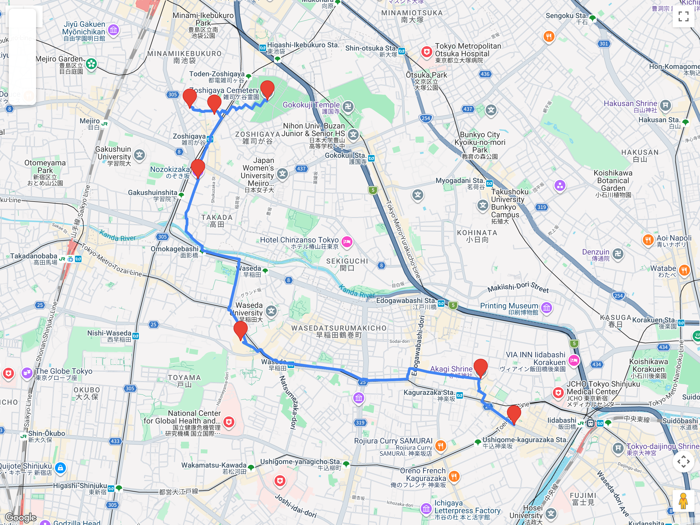

# Bloques urbanos – Tradicional / Shitamachi  
## Itinerario: Zoshigaya + Waseda + Kagurazaka

---

### Concepto del lugar

Este bloque propone un eje barrial y espiritual del noroeste: cementerio histórico, templos discretos y santuarios en ladera, con transición hacia Waseda y cierre cerca de Kagurazaka.  
Es un recorrido **más extenso**, de ritmo caminable y con pocas multitudes.

El foco está en:
- memoria urbana (cementerio y templos),
- pendientes y callejones locales,
- continuidad barrial hasta la zona alta de Kagurazaka.

---

### Estructura general del recorrido

**Zoshigaya → Waseda → Kagurazaka (cercanías)**

Se puede cortar en Waseda si el día viene largo.  
También se puede terminar en Iidabashi o en Kagurazaka-dori según energía.

---

### 1. Zoshigaya: cementerio + Kishimojin + Honnō-ji

Empezá en la zona de **Zoshigaya Cemetery** para entender el tono del día: árboles altos, calles internas tranquilas y una sensación de Tokio antiguo.  
Desde ahí, caminá hacia **Kishimojin-dō**, que es el corazón espiritual del barrio.

Si quieren sumar otro templo, incorporen **Honnō-ji** dentro del mismo tramo.  
Este primer bloque es lento a propósito: no es para “tachar”, es para observar.

---

### 2. Nozorizaka: la subida como transición

La pendiente de **Nozorizaka** funciona como bisagra natural entre el Zoshigaya silencioso y el Waseda más activo.  
Suban sin apuro, mirando los laterales: casas bajas, portones, callejones y cambios de nivel.

---

### 3. Waseda: Ana Hachimangū

En la zona de Waseda, el punto clave es **Ana Hachimangū**.  
Es un santuario con escala local, buena pausa para respirar y seguir.  
Si el día está pesado, este es un buen lugar para cortar y volver en metro.

---

### 4. Transición hacia Kagurazaka

Desde Waseda, el tramo hacia Kagurazaka es de barrios residenciales y calles con pendiente.  
No es una “atracción” puntual, sino el tramo de **paseo urbano** que unifica el bloque.

---

### 5. Akagi-jinja y cierre en Kagurazaka

Llegando a Kagurazaka, **Akagi-jinja** es el cierre ideal:  
contrasta arquitectura contemporánea con la espiritualidad del día y te deja a un paso de Kagurazaka-dori.

Podés cerrar:
- en **Kagurazaka-dori** (comida y paseo nocturno), o
- en **Iidabashi** para conexión rápida.

---

### Pausas / comida

- Waseda tiene cafeterías y opciones simples cerca del campus.  
- Kagurazaka es el lugar para cerrar con algo más elaborado: soba, izakaya o pastelería.

---

### Primavera (marzo-abril)

- El cementerio y los accesos de Zoshigaya tienen árboles con floración temprana; aprovechá la mañana.  
- Las pendientes entre Waseda y Kagurazaka tienen buen juego de luz al atardecer.

---

### Espíritu del día

Un bloque largo pero sereno: caminata lenta, memoria urbana y transición hacia un barrio histórico vivo.
