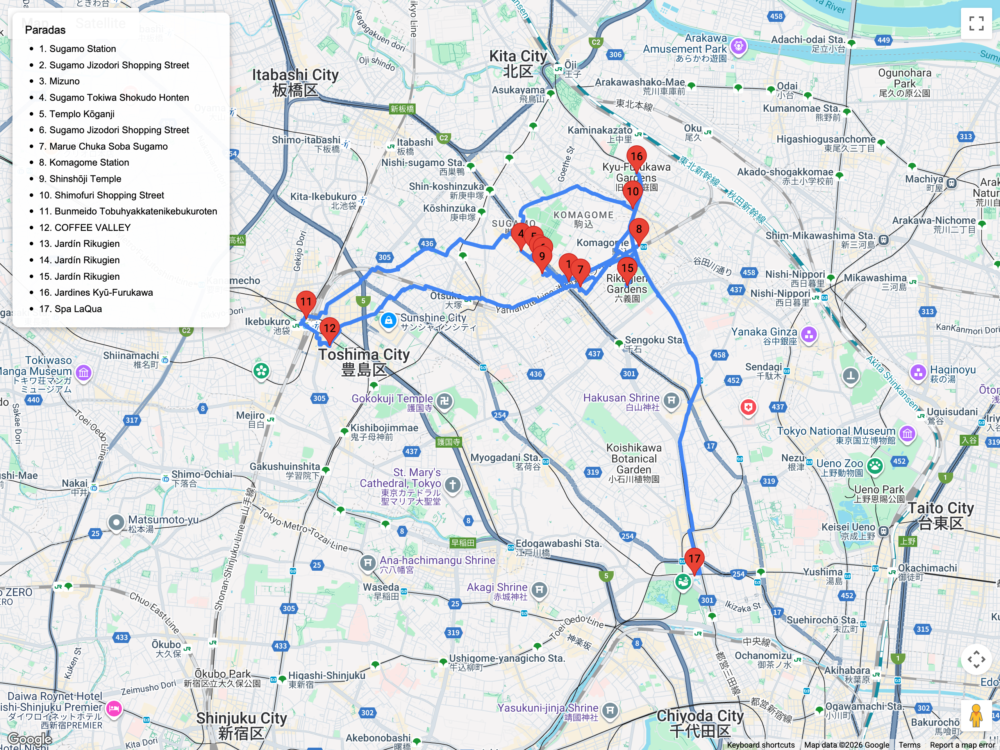

# Bloques urbanos – Tradicional / Shitamachi  
## Itinerario: Sugamo + Komagome + Rikugien

---

### Concepto del lugar

Día dedicado al “Harajuku de las abuelas”. Combina el shotengai devocional de Sugamo, templos tranquilos, y los jardines señoriales de Komagome. Ideal para ritmo lento, compras locales y un cierre en Rikugien con luces vespertinas si coincide temporada.

---

### Estructura general del recorrido

**Sugamo Station → Jizō-dōri → Kogan-ji → Komagome backstreets → Rikugien → Kyu-Furukawa (opcional)**

Funciona lineal: empezás en Sugamo y terminás cerca de JR Komagome/Metro.

---

### Sugamo Jizō-dōri Shotengai

- Salí por la salida A3 de la estación (Toei Mita) para entrar directo al shotengai techado.  
- Probá snacks clásicos: shio-daifuku en **Shio-no Daifuku Mizuno** y croquetas en **Sugamo Tokiwa Shokudō**.  
- Buscá textiles rojos (akapan) y tiendas de salud: buen recuerdo kitsch para el viaje 7.  
- El **Togenuki Jizō (Kogan-ji)** permite lavar la estatua para pedir salud; ahí podés sumar goshuin.

### Komagome & vecindario Taishō

- Caminá hacia Komagome “honchō”: hay casas bajas, cafés estilo kissaten y santuarios pequeños como **Shinshō-ji**.  
- Si querés shotengai alternativo, desviate por **Komagome Ginza-dōri** (más discreto pero local).  
- Cafés recomendados: **Bunmeido Café** (castella + té) y **Coffee Valley Komagome**.

### Rikugien (jardín daimyo)

- Entrá por la puerta principal (cobro en efectivo).  
- Recorrido sugerido: estanque central → colina Tsutsuji-no-chaya → té en el salón Fukiage.  
- En primavera y otoño hay iluminaciones; lo ideal es apuntar a las 16:30–18:00 para enganchar el cambio de luz y comprar ticket en el momento (sin reserva previa).  
- Goshuin: no aplica, pero sí sellos de recuerdo.

### Opcional: Kyu-Furukawa Gardens

- A 10 min caminando; combina mansión occidental + jardín japonés escalonado.  
- Buen lugar para fotos con rosas (temporada mayo/octubre).  
- Permitido entrar y salir con ticket combinado si pensás volver a Rikugien el mismo día.

### Primavera (marzo-abril)

- **Jizō-dōri** se llena de faroles y puestos especiales por hanami; llegá antes del mediodía para ver a la gente mayor tomando té en la calle.  
- **Rikugien** es uno de los mejores spots de sakura llorón: verificá las fechas de iluminación y comprá el ticket nocturno en cuanto llegues al parque.  
- Entre Komagome y Kyu-Furukawa vas a ver camelias y magnolias tardías; aunque las rosas todavía no florezcan, los jardines se sienten muy vivos.

### Consejos prácticos

- Usá la línea JR Yamanote o Toei Mita para moverte entre los puntos si llueve.  
- Para almuerzo, considerá **Sugamo Jizō-dōri Grill** (set de hamburg steak) o soba tradicional en **Azuma**.  
- Lleva efectivo: muchas tiendas aceptan solo yenes.  
- Si querés cerrar con onsen, **Spa LaQua** está a pocos minutos en metro (Kasuga) como alternativa nocturna.
